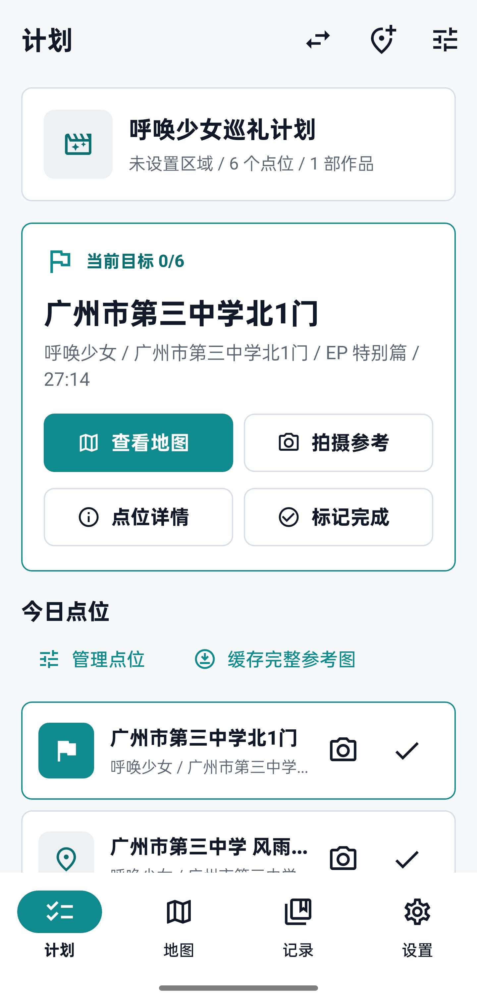
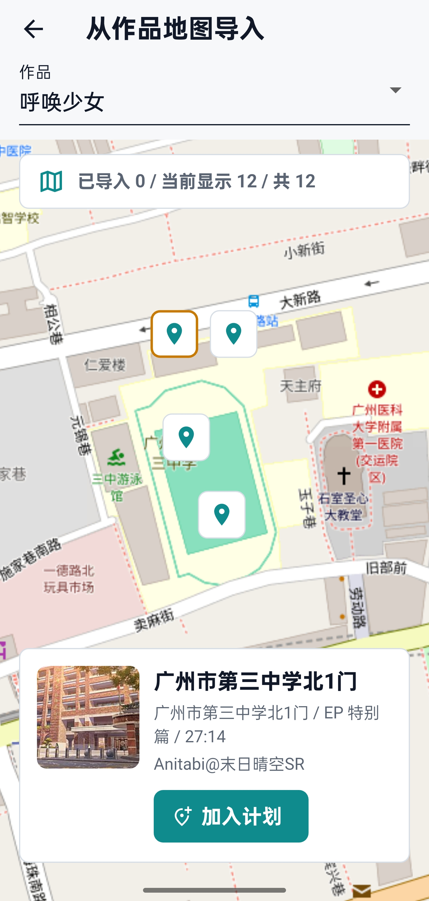
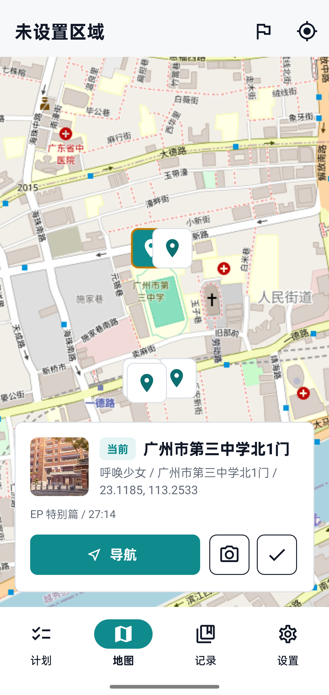

<p align="center">
  
</p>

<h1 align="center">MiriaGo</h1>

<p align="center">
  面向动漫圣地巡礼的计划、地图、拍摄参考与记录整理工具。
</p>

<p align="center">
  <a href="LICENSE"></a>
  
  
</p>

MiriaGo 使用 Flutter 开发，用于规划动漫圣地巡礼、从 Anitabi 导入点位、在现场拍摄时对照参考图，并整理巡礼记录、自动调色与分享用对比图。

当前仅支持 Android，计划后续增加 iOS 支持。Web 版本仅作为开发预览。

## 快速使用

- Android APK：请前往 [Releases](https://github.com/BilyHurington/MiriaGo/releases) 下载最新版本。
- 使用指南：[docs/USAGE.md](docs/USAGE.md)
- 由于使用的地图为 OpenStreetMap 与 Google Maps，国内使用时需要科学上网；不过对于各位想要现地巡礼的人来说，应该不是难事吧 hh。

## 功能亮点

- 多计划管理：创建、切换、重命名、导入和导出巡礼计划。
- 作品管理：通过 Bangumi 搜索添加作品，也支持手动添加。
- Anitabi 点位导入：在作品地图上查看点位、缩略图和详情，并按需加入计划。
- 地图与导航：使用 OpenStreetMap 显示计划点位，导航交给外部地图应用。
- 拍摄参考：现场拍摄时支持参考图叠影、上下参考和相册导入。
- 离线准备：导入点位时缓存缩略图，可在出发前批量缓存完整参考图。
- 巡礼记录：按作品查看记录，支持筛选、搜索、详情查看和删除。
- 自动调色：根据参考图生成可解释的调色参数，用强度滑块控制应用比例。
- 对比图导出：导出适合分享的参考图/巡礼图对比图，支持主题、元数据和巡礼者名称。

## 截图

<table>
  <tr>
    <td align="center" width="33%">
      <br>
      <sub>计划首页与当前目标</sub>
    </td>
    <td align="center" width="33%">
      <br>
      <sub>Anitabi 点位导入</sub>
    </td>
    <td align="center" width="33%">
      <br>
      <sub>地图与导航</sub>
    </td>
  </tr>
  <tr>
    <td align="center" width="33%">
      <a href="docs/sample_images/相机拍摄参考页面.jpg">
        
      </a><br>
      <sub>拍摄参考（截图待补充）</sub>
    </td>
    <td align="center" width="33%">
      <br>
      <sub>自动调色</sub>
    </td>
    <td align="center" width="33%">
      <br>
      <sub>对比图导出</sub>
    </td>
  </tr>
</table>

> 相机拍摄参考截图稍后补充。当前占位链接预留为 `docs/sample_images/相机拍摄参考页面.jpg`。

## 开发

需要安装：

- Flutter SDK
- Android Studio 或 Android SDK
- JDK
- 可选：已连接的 Android 设备

初始化依赖：

```bash
flutter pub get
```

检查代码：

```bash
flutter analyze --no-pub
flutter test --no-pub
```

构建 Android release APK：

```bash
flutter build apk --release --no-pub
```

安装到已连接 Android 设备：

```bash
adb install -r build/app/outputs/flutter-apk/app-release.apk
```

构建 Web 预览：

```bash
flutter build web --no-pub
python3 -m http.server 8080 --directory build/web
```

## Release 构建

仓库包含 GitHub Actions release workflow：

- 手动触发：`Actions` -> `Android Release` -> `Run workflow`
- 发布触发：推送 `v*` tag，例如 `v1.0.0`

正式签名 APK 需要在 GitHub Actions Secrets 中配置：

```text
ANDROID_KEYSTORE_BASE64
ANDROID_KEYSTORE_PASSWORD
ANDROID_KEY_ALIAS
ANDROID_KEY_PASSWORD
```

本地签名文件不会提交到仓库。请妥善备份 release keystore。

## 第三方服务与数据

本项目代码使用 MIT License 开源，但应用中显示或访问的第三方数据不属于本项目。

- 地图瓦片和地图数据来自 OpenStreetMap。使用时应保留 `OpenStreetMap contributors` 署名，并遵守 OpenStreetMap 官方瓦片使用政策。
- 作品搜索使用 Bangumi API。非浏览器 API 请求需要设置清晰的 User-Agent。
- 巡礼点位和参考图来自 Anitabi。点位、截图、图片和相关元数据的版权归原平台、贡献者或权利方所有。本项目只提供客户端访问与用户本地缓存能力，不在仓库中分发这些数据。

## 开源协议

本项目代码基于 [MIT License](LICENSE) 开源。
