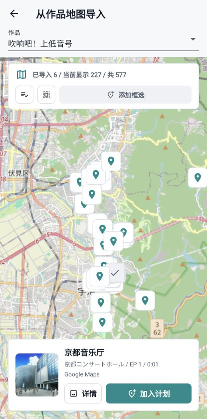
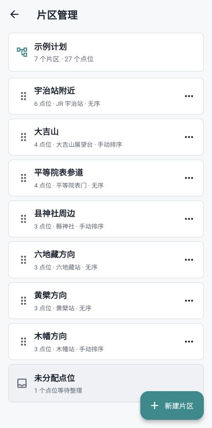
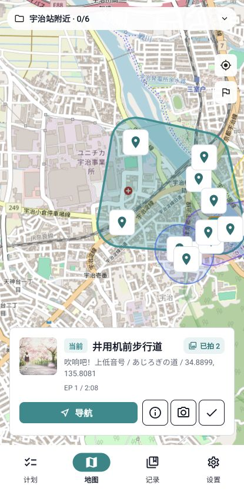
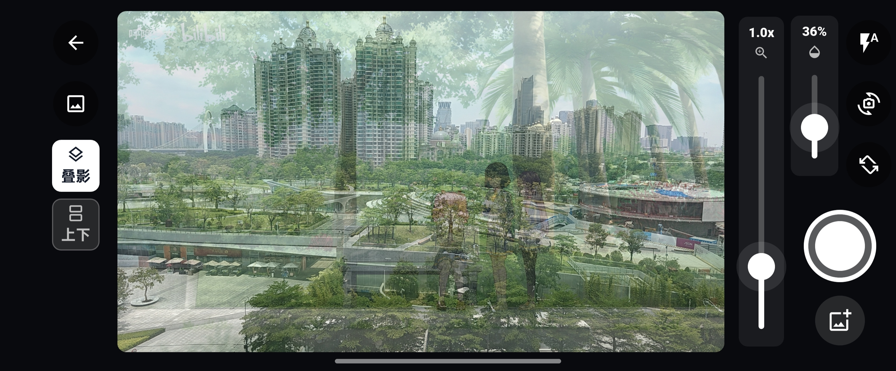
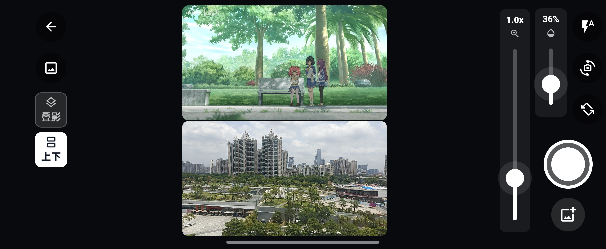
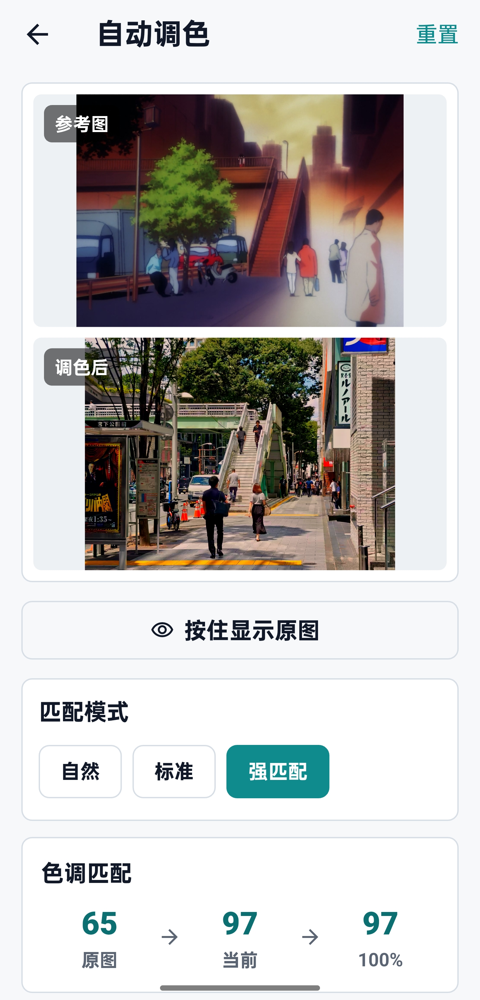
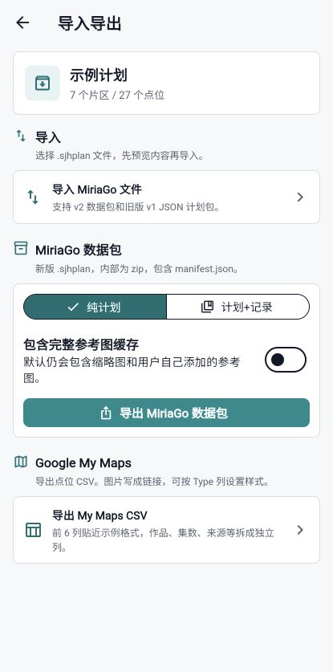

<p align="center">
  
</p>

<h1 align="center">MiriaGo</h1>

<p align="center">
  面向动漫圣地巡礼的计划、地图、拍摄参考与记录整理工具。
</p>

<p align="center">
  <a href="LICENSE"></a>
  
  
  
  
  
</p>

MiriaGo 使用 Flutter 开发，用于规划动漫圣地巡礼、从 Anitabi 导入点位、在现场拍摄时对照参考图，并整理巡礼记录、自动调色与分享用对比图。

当前目标平台包括 Android、iOS、macOS 和 Windows。桌面端由 Tauri 启动器承载 Web 前端，并把数据保存在应用同目录的本地数据文件夹中；普通 Web 版本主要用于开发预览。

## 为什么需要 MiriaGo

巡礼前：点位散在网页里。巡礼时：相机和参考图来回切。巡礼后：照片、调色、拼图还要慢慢整理。

MiriaGo 想把这些麻烦收进一个顺手的流程里：

- **从查点到计划，一次整理好**：不用在 Anitabi、Google 地图和笔记之间来回搬运点位，直接按作品导入，形成可执行的巡礼计划、点位队列和当前目标。
- **现场少切应用，更容易对齐构图**：拍摄时直接在相机里查看参考图，支持叠影和上下对照，不用在相机、相册、网页之间反复切换。
- **提前缓存，降低现场网络依赖**：出发前缓存参考图和点位信息，现场网络不稳定时也能继续查看、拍摄和记录。
- **照片自动归档，不用回来手动整理**：巡礼照片会绑定到对应作品和点位，记录拍摄时间、参考图和完成状态，方便复盘、补拍和管理。
- **自动调色与对比图导出，分享更省事**：根据参考图生成调色效果，并直接导出统一风格的巡礼对比图，不再依赖在线拼图工具或手动修图。

## 快速使用

- Android APK：请前往 [Releases](https://github.com/BilyHurington/MiriaGo/releases) 下载最新版本。
- iOS：当前通过 TestFlight 分发测试版本。
- macOS / Windows：Release 中提供 zip 包，解压后直接运行，数据保存在随包的 `MiriaGoData` 文件夹中。
- 使用指南：[docs/USAGE.md](docs/USAGE.md)
- 由于使用的地图为 OpenStreetMap 与 Google Maps，国内使用时需要科学上网；不过对于各位想要现地巡礼的人来说，应该不是难事吧 hh。

## 功能亮点

- 多计划管理：创建、切换、重命名、导入和导出巡礼计划。
- 作品管理：通过 Bangumi 搜索添加作品，也支持手动添加。
- Anitabi 点位导入：在作品地图上查看点位、缩略图和详情，并按需加入计划。
- 地图与导航：使用 OpenStreetMap 显示计划点位，导航交给外部地图应用。
- 拍摄参考：现场拍摄时支持参考图叠影、上下参考和相册导入。
- 离线准备：导入点位时缓存缩略图，可在出发前批量缓存完整参考图。
- 巡礼记录：按作品查看记录，支持筛选、搜索、详情查看和删除。
- 自动调色：根据参考图生成可解释的调色参数，用强度滑块控制应用比例。
- 对比图导出：导出适合分享的参考图/巡礼图对比图，支持主题、元数据和巡礼者名称。
- 计划数据包：`.sjhplan` v2 数据包可包含计划结构、记录、照片和参考图资源，导入时可恢复本地资源。
- 桌面端本地存储：macOS / Windows 版本使用内置数据库和本地资源目录，导出数据包与 CSV 时可选择保存位置。

## 效果展示

<table>
  <tr>
    <td align="center" width="33%">
      <br>
      <sub>计划首页与当前目标</sub>
    </td>
    <td align="center" width="33%">
      <br>
      <sub>Anitabi 点位导入</sub>
    </td>
    <td align="center" width="33%">
      <br>
      <sub>片区、关键点与顺序管理</sub>
    </td>
  </tr>
  <tr>
    <td align="center" width="33%">
      <br>
      <sub>地图与导航</sub>
    </td>
    <td align="center" width="33%">
      <br>
      <br>
      <sub>拍摄参考：叠层 / 上下</sub>
    </td>
    <td align="center" width="33%">
      <br>
      <sub>自动调色</sub>
    </td>
    <td align="center" width="33%">
      <br>
      <sub>v2 数据包导入导出</sub>
    </td>
  </tr>
</table>

## 开发

需要安装：

- Flutter SDK
- Android Studio 或 Android SDK
- JDK
- iOS 构建需要 macOS 与 Xcode
- 桌面端构建需要 Node.js、Rust 和系统 WebView 运行环境
- 可选：已连接的 Android 设备

初始化依赖：

```bash
flutter pub get
```

检查代码：

```bash
flutter analyze --no-pub
flutter test --no-pub
```

构建 Android release APK：

```bash
flutter build apk --release --no-pub
```

安装到已连接 Android 设备：

```bash
adb install -r build/app/outputs/flutter-apk/app-release.apk
```

构建 Web 预览：

```bash
flutter build web --no-pub
python3 -m http.server 8080 --directory build/web
```

构建 Tauri 桌面端：

```bash
npm install
npm run desktop:build
```

## Release 构建

仓库包含以下 GitHub Actions workflow：

- Android Release：构建 Android release APK。
- iOS Build Check：执行无签名 iOS 构建检查。
- Desktop Launcher：构建 macOS / Windows 桌面端 zip 包。
- 发布触发：推送 `v*` tag，例如 `v1.1.0`。

正式签名 APK 需要在 GitHub Actions Secrets 中配置：

```text
ANDROID_KEYSTORE_BASE64
ANDROID_KEYSTORE_PASSWORD
ANDROID_KEY_ALIAS
ANDROID_KEY_PASSWORD
```

本地签名文件不会提交到仓库。请妥善备份 release keystore。

iOS 本地归档和 TestFlight 上传需要在 Xcode 中选择自己的 Apple Developer Team；仓库不保存个人签名团队配置。桌面端 Release 会产出 `MiriaGo-macos.zip` 和 `MiriaGo-windows-x64.zip`，zip 内包含应用本体和 `MiriaGoData` 数据文件夹。

## 第三方服务与数据

本项目代码使用 MIT License 开源，但应用中显示或访问的第三方数据不属于本项目。

- 地图瓦片和地图数据来自 OpenStreetMap。使用时应保留 `OpenStreetMap contributors` 署名，并遵守 OpenStreetMap 官方瓦片使用政策。
- 作品搜索使用 Bangumi API。非浏览器 API 请求需要设置清晰的 User-Agent。
- 巡礼点位和参考图来自 Anitabi。点位、截图、图片和相关元数据的版权归原平台、贡献者或权利方所有。本项目只提供客户端访问与用户本地缓存能力，不在仓库中分发这些数据。

## 开源协议

本项目代码基于 [MIT License](LICENSE) 开源。
