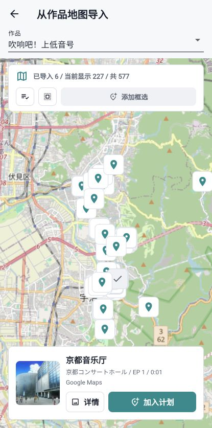
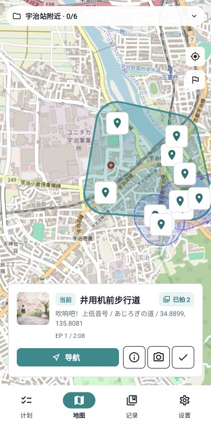
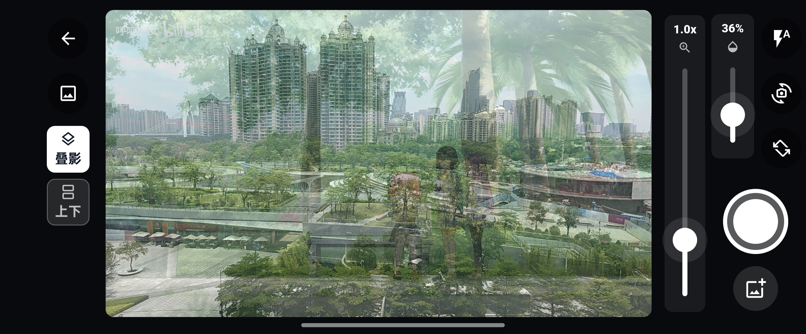
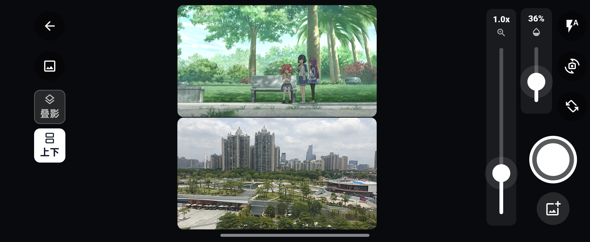

<p align="center">
  
</p>

<h1 align="center">MiriaGo</h1>

<p align="center">
  面向动漫圣地巡礼的计划、地图、拍摄参考与记录整理工具。
</p>

<p align="center">
  <a href="LICENSE"></a>
  
  
  
  
  
  
</p>

MiriaGo 使用 Flutter 开发，用于规划动漫圣地巡礼、从 Anitabi 导入点位、在现场拍摄时对照参考图，并整理巡礼记录、自动调色与分享用对比图。

当前目标平台包括 Android、iOS、macOS、Windows 和 Linux。桌面端由 Tauri 启动器承载 Web 前端，并使用本地数据库和资源目录保存数据；普通 Web 版本主要用于开发预览。

## 视频介绍

- V1.0：[Bilibili BV1jHG26ZECg](https://www.bilibili.com/video/BV1jHG26ZECg/)
- V1.1：[Bilibili BV1kDJA6eEfQ](https://www.bilibili.com/video/BV1kDJA6eEfQ/)

## iOS TestFlight 测试

如果想加入 iOS TestFlight 测试，可以加入测试群获取链接：`904476316`。

群里也会提供测试版本 App。测试版本通常会比 GitHub 正式 Release 更早包含一些小 bug 修复，因为很多小修复不会立刻在 GitHub 上发布新版本。

## 为什么需要 MiriaGo

巡礼前：点位散在网页里。巡礼时：相机和参考图来回切。巡礼后：照片、调色、拼图还要慢慢整理。

MiriaGo 想把这些麻烦收进一个顺手的流程里：

- **从查点到计划，一次整理好**：不用在 Anitabi、Google 地图和笔记之间来回搬运点位，直接按作品导入，形成可执行的巡礼计划、点位队列和当前目标。
- **现场少切应用，更容易对齐构图**：拍摄时直接在相机里查看参考图，支持叠影和上下对照，不用在相机、相册、网页之间反复切换。
- **提前缓存，降低现场网络依赖**：出发前缓存参考图和点位信息，现场网络不稳定时也能继续查看、拍摄和记录。
- **照片自动归档，不用回来手动整理**：巡礼照片会绑定到对应作品和点位，记录拍摄时间、参考图和完成状态，方便复盘、补拍和管理。
- **自动调色与对比图导出，分享更省事**：根据参考图生成调色效果，并直接导出统一风格的巡礼对比图，不再依赖在线拼图工具或手动修图。

## 快速使用

- Android APK：请前往 [Releases](https://github.com/BilyHurington/MiriaGo/releases) 下载最新版本。
- iOS：当前通过 TestFlight 分发测试版本。
- macOS / Windows：Release 中提供 zip 包。Linux x64 提供 AppImage、DEB、RPM 和 zip；Linux zip 需要系统已安装 WebKitGTK 4.1 等运行依赖，并非独立免依赖包。Windows / Linux zip 含随包的 `MiriaGoData` 文件夹。
- 使用指南：[docs/USAGE.md](docs/USAGE.md)
- 数据源默认使用 OpenFreeMap + MapLibre 显示地图，并使用 Anitabi 默认图片源读取参考图。设置中可以切换 OpenFreeMap 样式、OpenStreetMap、自定义 XYZ 瓦片 URL、自定义 MapLibre style URL，以及 Anitabi 参考图备用图片源。导航仍交给外部地图应用，例如 Google Maps 或系统地图。

## 功能亮点

- 多计划管理：创建、切换、重命名、导入和导出巡礼计划。
- 作品管理：通过 Bangumi 搜索添加作品，也支持手动添加。
- Anitabi 点位导入：在作品地图上查看点位、缩略图和详情，并按需加入计划。
- 地图与导航：默认使用 OpenFreeMap + MapLibre 显示计划点位，也支持多种 OpenFreeMap 样式、OpenStreetMap、自定义 XYZ 瓦片和自定义 MapLibre style，导航交给外部地图应用。
- 拍摄参考：现场拍摄时支持参考图叠影、上下参考和相册导入。
- 离线准备：导入点位时缓存缩略图，可在出发前批量缓存完整参考图。
- 巡礼记录：按作品查看记录，支持筛选、搜索、详情查看和删除。
- 自动调色：根据参考图生成可解释的调色参数，用强度滑块控制应用比例。
- 对比图导出：导出适合分享的参考图/巡礼图对比图，支持主题、元数据和巡礼者名称。
- 计划数据包：`.sjhplan` v2 数据包可包含计划结构、记录、照片和参考图资源，导入时可恢复本地资源。
- 桌面端本地存储：macOS 使用系统应用数据目录，Windows 使用随包的 `MiriaGoData` 文件夹（不可写时回退）。Linux zip 通过随包的 `MiriaGoData` 目录启用便携存储；AppImage / DEB / RPM 使用 `$XDG_DATA_HOME/MiriaGo`，通常为 `~/.local/share/MiriaGo`。Linux 便携目录尚无数据且不可写时回退到用户目录，已有用户目录数据时继续复用；已有便携数据但不可写则报错，不静默切换到空数据库。导出数据包与 CSV 时可选择保存位置。

## 效果展示

<table>
  <tr>
    <td align="center" width="33%">
      <br>
      <sub>计划首页与当前目标</sub>
    </td>
    <td align="center" width="33%">
      <br>
      <sub>Anitabi 点位导入</sub>
    </td>
    <td align="center" width="33%">
      <br>
      <sub>片区、关键点与顺序管理</sub>
    </td>
  </tr>
  <tr>
    <td align="center" width="33%">
      <br>
      <sub>地图与导航</sub>
    </td>
    <td align="center" width="33%">
      <br>
      <br>
      <sub>拍摄参考：叠层 / 上下</sub>
    </td>
    <td align="center" width="33%">
      <br>
      <sub>自动调色</sub>
    </td>
  </tr>
</table>

## 开发

需要安装：

- Flutter SDK
- Android Studio 或 Android SDK
- JDK
- iOS 构建需要 macOS 与 Xcode
- 桌面端构建需要 Node.js、Rust 和系统 WebView 运行环境；Linux 需要 WebKitGTK 4.1 等 Tauri 系统依赖
- 可选：已连接的 Android 设备

初始化依赖：

```bash
flutter pub get
```

Linux 本地构建前，Ubuntu / Debian 可以先安装桌面依赖：

```bash
sudo apt-get update
sudo apt-get install -y libwebkit2gtk-4.1-dev build-essential curl wget file libgtk-3-dev libxdo-dev libssl-dev libayatana-appindicator3-dev librsvg2-dev patchelf rpm libfuse2
```

如果发行版没有 `libfuse2` 包，可以改装 `libfuse2t64`。

Linux 构建基线为 Ubuntu 22.04 x64。AppImage 通常需要 FUSE 2，DEB / RPM 应通过系统包管理器安装以解析依赖；zip 需要自行安装 WebKitGTK 4.1、GTK 3 等运行库。不同发行版的图形驱动和 WebKitGTK 版本仍需实际验证，不承诺支持全部发行版或 ARM64。不要以 root 身份运行应用。

Linux 以 `C` / `C.UTF-8` / `POSIX` 等无语言环境启动时，启动器仅在当前进程中为 WebKit 设置有效的首选语言，避免 Flutter 初始化时报 `invalid language tag`；正常的中文、日文等语言设置保持不变，不修改系统配置。

升级便携版时请保留整个 `MiriaGoData` 目录，不要用压缩包里的空目录覆盖它。AppImage 的挂载/解压目录不用于保存新数据；若检测到早期版本已在其中写入数据库，应用会提示备份并迁移整个目录到上述用户目录，不自动删除或覆盖数据。便携版与安装版使用不同目录时，可通过计划包迁移数据。

检查代码：

```bash
flutter analyze --no-pub
flutter test --no-pub
```

构建 Android release APK：

```bash
flutter build apk --release --no-pub
```

安装到已连接 Android 设备：

```bash
adb install -r build/app/outputs/flutter-apk/app-release.apk
```

构建 Web 预览：

```bash
flutter build web --no-pub
python3 -m http.server 8080 --directory build/web
```

构建 Tauri 桌面端：

```bash
npm install
npm run desktop:build
```

Linux 发行包可以使用：

```bash
npm install
npm run desktop:build:linux
```

## Release 构建

仓库包含以下 GitHub Actions workflow：

- Android Release：构建 Android release APK。
- iOS Build Check：执行无签名 iOS 构建检查。
- Desktop Launcher：构建 macOS / Windows / Linux 桌面端 zip 包，并附带对应平台安装包。
- 发布触发：推送 `v*` tag，例如 `v1.1.0`。

正式签名 APK 需要在 GitHub Actions Secrets 中配置：

```text
ANDROID_KEYSTORE_BASE64
ANDROID_KEYSTORE_PASSWORD
ANDROID_KEY_ALIAS
ANDROID_KEY_PASSWORD
```

本地签名文件不会提交到仓库。请妥善备份 release keystore。

iOS 本地归档和 TestFlight 上传需要在 Xcode 中选择自己的 Apple Developer Team；仓库不保存个人签名团队配置。桌面端 Release 会产出带版本号的 macOS、Windows x64 和 Linux x64 zip；macOS zip 只包含应用本体，Windows / Linux zip 包含应用本体和 `MiriaGoData` 数据文件夹。Windows 仅提供便携版本，不提供 setup 安装包；Linux 额外产出 AppImage、Debian 和 RPM 包。

## 第三方服务与数据

本项目代码使用 MIT License 开源，但应用中显示或访问的第三方数据不属于本项目。

- 地图底图可来自 OpenFreeMap、OpenStreetMap 或用户配置的自定义地图服务。使用时应保留对应地图服务要求的署名，并遵守对应服务的使用政策；如果使用自定义 XYZ 或 MapLibre style URL，请确认该服务允许客户端应用访问。
- Anitabi 参考图访问可在设置中选择默认图片源或备用图片源；该设置只影响运行时访问域名，应用内保存和导出的远端参考图链接会继续保留 Anitabi 默认格式。
- 作品搜索使用 Bangumi API。非浏览器 API 请求需要设置清晰的 User-Agent。
- 巡礼点位和参考图来自 Anitabi。点位、截图、图片和相关元数据的版权归原平台、贡献者或权利方所有。本项目只提供客户端访问与用户本地缓存能力，不在仓库中分发这些数据。

## 开源协议

本项目代码基于 [MIT License](LICENSE) 开源。

## 第三方许可证

本项目使用 [`lucide_icons_flutter`](https://pub.dev/packages/lucide_icons_flutter) 提供 Lucide 图标。该软件包以 MIT License 发布，Copyright (c) 2024 vqhapp；许可证全文见软件包发行内容中的 `LICENSE` 文件。
