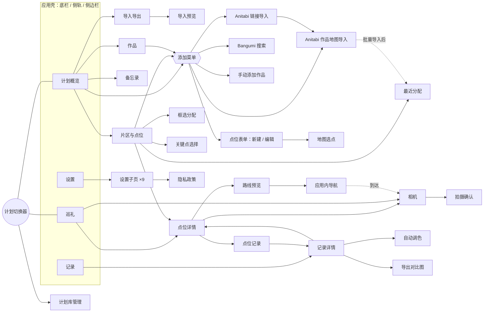

# MiriaGo Next · UI 重写设计文档

> 版本 v0.1 草案 · 2026-09-27 · 状态：**待确认，确认前不开始开发**
>
> 范围：在 `MiriaGo-Next/` 中重写 MiriaGo 的全部界面，复用现有后端。
>
> 配套文件：[`FEATURE_CHECKLIST.md`](FEATURE_CHECKLIST.md)，逐项列出旧功能在新界面中的位置，作为开发验收清单。
>
> 旧项目基线：`Seichi-Junrei-Helper` 分支 `codex/pre-2-release-hardening`，提交 `849fd9a`（含第 6–13 批修复）。

---

## 目录

0. [一页结论](#0-一页结论)
1. [背景、目标与约束](#1-背景目标与约束)
2. [技术选型](#2-技术选型)
3. [设计原则](#3-设计原则)
4. [信息架构](#4-信息架构)
5. [自适应布局系统](#5-自适应布局系统)
6. [视觉语言](#6-视觉语言)
7. [组件库](#7-组件库)
8. [页面设计](#8-页面设计)
9. [核心流程走查](#9-核心流程走查)
10. [行为变更清单（需确认）](#10-行为变更清单需确认)
11. [工程架构](#11-工程架构)
12. [开发计划](#12-开发计划)
13. [风险](#13-风险)
14. [需要你确认的问题](#14-需要你确认的问题)

---

## 0. 一页结论

| 项 | 决定 |
|---|---|
| 技术栈 | **继续使用 Flutter**（本机 3.44 / Dart 3.12）。后端 Dart 代码、Android/iOS 原生相机与各平台通道、Tauri 桌面壳全部原样复用。 |
| UI 基座 | 底层用 Material 3 控件，负责无障碍、输入法、滚动和各平台行为。上层自建 **Miria 设计系统**（设计 token + 约 30 个组件）。不整体套用第三方组件库。 |
| 新增依赖 | `go_router`（路由、URL、深链）、`smooth_sheets`（地图上的吸附面板）、`flutter_animate`（微动效）、`material_symbols_icons`（图标）、`provider`（依赖注入）。内置 Inter 字体负责西文和数字，中日文用系统字体。 |
| 信息架构 | 一级入口 4 个：**计划 / 巡礼 / 记录 / 设置**。旧的「计划列表」和「地图」合并为 **巡礼**（地图 + 吸附面板）。旧的添加内容、管理计划、片区管理、作品管理等二三级页面收拢到 **计划** 工作区。 |
| 自适应 | 按窗口宽度分 5 档、高度另设 1 档，据此切换导航形态（底栏 / 侧轨 / 侧边栏）和版式（单栏 / 列表-详情 / 地图 + 侧面板 / 三栏）。手机横屏、iPad 分屏与台前调度、折叠屏、任意尺寸的桌面窗口都有对应布局。 |
| 视觉 | 从 App 图标取色：**青绿主色 + 奶白暖纸底色 + 向日葵黄点位色**。图标里「一条路线串起几个圆点」的造型作为贯穿全应用的标志性元素。 |
| 工程 | 后端文件保持和旧仓库**完全相同的路径**，方便继续同步 2.0 的修复。新增 `lib/application/` 用例层，把旧页面里的业务流程**原样搬出**并补上测试。新 UI 全部放在 `lib/ui/`。 |
| 预览 | 普通 Web 版 + 示例数据（沿用 `SamplePilgrimageRepository`），端口 8792。另做一个「布局实验室」页面，在一屏内同时预览手机、平板、桌面三种尺寸。 |
| 节奏 | 阶段 0 基座 → 1 设计系统（**第一个评审点**）→ 2 用例层与 3 功能页面（子 agent 并行）→ 4 相机与导航（需真机）→ 5 平台集成与验收。 |

---

## 1. 背景、目标与约束

### 1.1 现有 UI 的问题

结论来自代码清点、截图和 `UI_AUDIT_2026_09_08.md`：

1. **只为手机竖屏设计。** 移动端锁定竖屏；桌面 Tauri 窗口默认 430×860，也就是一个「手机形状的窗口」。规划侧没有横屏或双栏版式，大屏上只是把手机界面拉伸。
2. **「计划」和「地图」是两个标签页，展示的却是同一批数据。** 巡礼当天用户要在列表和地图之间来回切换，而且两边的片区选择、选中点位各自维护。
3. **层级深，入口分散。** 添加点位要走 计划 →(展开操作面板)→ 添加内容 → 作品管理 → Bangumi 搜索 → 返回 → 从作品地图导入。片区管理藏在「管理计划」的工具栏里。计划操作面板默认折叠。
4. **同一件事有多份实现，行为还不一致。** 新建片区的对话框实现了 5 次，校验不同；关键点选择页有两份；片区前后切换在一处循环、另一处不循环；完成状态的文案有「撤回打卡 / 取消完成 / 重置」三种说法。
5. **页面缩放只作用于部分页面。** 用 `MaterialPageRoute` 推入的页面没有吃到缩放设置。
6. **页面之间靠「返回后整体重载」同步数据。** 各页面直接调用仓库约 110 处，返回时再重建控制器。这种模式放不进多栏布局：多栏里好几个面板同时展示同一份计划。
7. **业务流程写在页面里。** 保存记录的提交协议、拍摄管线、Anitabi 导入、调色保存、导出编排都在 UI 文件中，重写 UI 时很容易误伤。

### 1.2 目标

- 保留全部现有功能和基本使用流程（详见 `FEATURE_CHECKLIST.md`）。
- 重新设计信息架构、页面分组、跳转关系、交互和视觉。
- 适配任意屏幕比例和常见分辨率：手机竖屏和横屏、小屏机、折叠屏、iPad 全屏、分屏、Slide Over 和台前调度、桌面 360 px 到 4K 的任意窗口，系统不限。
- **简单易用**：巡礼当天常用的操作一两步就能完成。**足够精致**：视觉统一、动效克制、细节到位。
- 先做可在浏览器里查看的 Web 版并接入示例数据，再接入各平台。

### 1.3 非目标

- 不改数据模型、数据库结构、导入导出格式和原生通道协议。
- 不增加云同步、账号等新业务能力。本次新增的只有纯界面层面的便利功能，都列在第 10 节。
- 不追求像素级复刻旧界面。

### 1.4 硬约束（为了让旧版用户能原地升级）

| 约束 | 原因 |
|---|---|
| Dart 包名保持 `miriago`；Android `applicationId`、iOS bundle id、Tauri identifier 不变 | 原地升级，测试的 import 路径不用改 |
| Drift schema v43 和数据库文件名 `seichi_junrei.sqlite` 不变 | 用户数据零迁移 |
| `.sjhplan` v1/v2、My Maps CSV 格式不变 | 已导出的备份仍能导入 |
| MethodChannel、EventChannel、PlatformView 的名称与参数不变 | Kotlin/Swift 代码原样复制 |
| 22 个 Tauri 命令和桌面 JSON 契约不变 | `src-tauri` 原样复制 |
| `AppSettings` 的 47 个字段不增删 | UI 可以隐藏已经过时的字段 |
| 地图、Anitabi、Bangumi 的署名必须可见 | 第三方服务的使用条款 |

---

## 2. 技术选型

### 2.1 为什么继续用 Flutter，而不换 Web 技术栈

曾考虑的另一条路是 React/Svelte + Tailwind，移动端用 Tauri 2 Mobile 或 Capacitor 打包。

| 维度 | Flutter（推荐） | Web 技术栈 |
|---|---|---|
| 「后端直接复制」 | 约 3.3 万行 Dart 后端原样可用（含 1.1 万行 Drift 生成代码） | 只有 Rust 部分能复用。仓库、导入导出、调色算法、对比图渲染器、Anitabi/Bangumi 客户端都要改写成 TS |
| 用户数据 | 同一个 Drift 数据库，原地升级 | 需要为已安装用户写数据库迁移 |
| 相机 | 现有 CameraX / AVFoundation 的 PlatformView 与通道原样可用 | WebView 里做实时叠影相机难度大（`getUserMedia` 对镜头、变焦、全分辨率拍摄的控制都不足），或者要重写原生插件 |
| 测试 | 约 60 个逻辑测试文件直接复用 | 几乎全部重写 |
| 自适应与精致度 | 需要自建布局系统（本文第 5 节），可控性高 | CSS 做自适应天然方便，组件生态更丰富 |
| 桌面 | 现有 Tauri 壳本来就承载 Flutter Web，原样可用 | 同样用 Tauri |

结论：换栈的收益主要在 Web 端的开发体验，代价却是把「重写 UI」变成「重写整个应用」。**保持 Flutter。**

### 2.2 为什么自建设计系统，不用现成的组件库

| 候选 | 版本 | 不选的原因 |
|---|---|---|
| forui | 0.27.2 | 需要 Flutter ≥ 3.47（本机 3.44）；0.x 版本频繁破坏性升级；shadcn 式的黑白后台风格，不适合移动优先的旅行应用 |
| shadcn_ui | 0.57.1 | 同样是 Web 后台风格；抽屉、分页等组件仍未完成 |
| shadcn_flutter | 0.0.54 | 版本太早，还要替换 MaterialApp |

需要的组件大约 30 个（第 7 节）。在 Material 3 控件的基础上自建，外观完全可控，也不会被上游升级拖着走。只引入几个**单一职责、足够成熟**的库：

| 库 | 用途 | 状态 |
|---|---|---|
| `go_router` ^18 | 声明式路由；Web 与桌面有真实 URL 和浏览器前进后退；`StatefulShellRoute` 保留各标签页状态 | Flutter 官方维护 |
| `smooth_sheets` ^1.2 | 可吸附的常驻面板（类似 Apple 地图）、面板内分页导航、模态面板 | 活跃，650+ likes |
| `flutter_animate` | 微动效（列表入场、打卡动画、数字滚动） | 活跃 |
| `material_symbols_icons` | 4000+ 图标，Rounded 风格，可变字体：填充、粗细、光学尺寸可调，也可以做动画 | 活跃，每月随上游更新 |
| `provider` | 依赖注入和 `context.select` 细粒度重建 | 稳定 |
| Inter 字体（内置文件，OFL 许可） | 西文与数字，支持等宽数字 | — |

现有依赖全部保留：`flutter_map`、`maplibre`、`drift`、`camerawesome`、`image_picker`、`geolocator`、`share_plus`、`file_selector` 等。**不再使用 `lucide_icons_flutter`**（这一条待确认，见第 14 节）。

### 2.3 地图

继续用现有方案：`flutter_map` 负责手势和坐标，MapLibre 图层同步渲染 OpenFreeMap 矢量样式，还支持栅格瓦片和自定义样式。手势完全在 Flutter 这一侧处理，所以在地图上叠放吸附面板、浮动按钮和框选层都不需要额外的指针拦截。旧项目的样式本地化、深色样式和署名逻辑原样复用。

---

## 3. 设计原则

1. **永远看得到「下一个去哪、拍什么」。** 巡礼页的当前目标卡片在任何尺寸下都可见，最多一步就能导航、拍摄或打卡。
2. **地图和列表是同一份数据的两种视图。** 它们放在同一个页面里，共享同一个片区选择和同一个选中点位。
3. **准备和执行分开。** 整理、导入、批量操作放在「计划」；出行时只用「巡礼」，界面上不出现编辑类噪音。
4. **自适应，而不是缩放。** 版式根据可用宽度、高度和输入方式重新排列，而不是把手机界面放大。
5. **渐进披露。** 高级设置、批量操作、少用字段默认收起，但不要藏得太深，最多两层。
6. **状态可见。** 缓存进度、离线可用性、定位状态、保存是否确认完成，都要有明确的界面表达，因为出行时的网络不可靠。
7. **拇指可达，键鼠友好。** 手机上的主要操作放在下半屏；桌面有悬停反馈、右键菜单和基本快捷键。

---

## 4. 信息架构

### 4.1 一级入口

| 入口 | 图标（Material Symbols） | 用途 | 取代的旧页面 |
|---|---|---|---|
| **计划** | `event_note` | 准备阶段的工作区：概览、片区与点位整理、作品、备忘录、导入导出、添加内容 | 计划标签页的操作面板、添加内容、作品管理、管理计划、片区管理、最近/框选分配、备忘录、导入导出 |
| **巡礼** | `explore` | 出行当天：地图、当前目标、片区队列、导航、拍摄、打卡 | 计划标签页的点位列表、地图标签页 |
| **记录** | `photo_library` | 巡礼照片的浏览、筛选、详情、调色和导出 | 记录标签页及其下级页面 |
| **设置** | `settings` | 全部设置 | 设置标签页 |

- 标签顺序按准备 → 出发 → 回顾排列。
- 启动时进入上次使用的标签。首次启动时，计划里还没有点位就进「计划」，否则进「巡礼」。
- **切换计划**不再是一个独立页面，而是一个「计划切换器」（第 8.8 节），从计划页和巡礼页的标题胶囊、桌面侧边栏顶部打开。

### 4.2 页面地图



相机、拍摄确认、应用内导航、图片查看器是**全屏页面**，打开时隐藏应用壳。其余页面都在应用壳内部。

### 4.3 关键概念在界面上怎么呈现

| 概念 | 数据来源 | 界面呈现 |
|---|---|---|
| 当前计划 | `repository.loadActivePlan` | 计划页、巡礼页标题上的胶囊（计划名 ▾）；桌面侧边栏顶部 |
| 当前片区 | `plan.currentGroupId` | 巡礼面板顶部的片区切换器；在计划与巡礼之间保持一致 |
| 当前目标 | `plan.currentPointId` | 巡礼面板里的「当前目标」卡片；地图上的黄色星形标记 ✦；列表行上的星标 |
| 选中点位 | `controller.selectedPoint`，仅存在于界面 | 地图标记放大并显示标签；列表行高亮；宽屏时右侧检查器显示它的详情 |
| 点位状态 | `statusFor`：待访问 / 当前目标 / 已完成 | 统一的状态徽章与标记样式（第 6.8 节）。操作文案统一为「设为当前目标 / 标记完成 / 取消完成」 |
| 后台任务 | `ReferenceCacheTask` | 顶部栏或侧边栏上常驻的小进度指示器，点开看详情，结束后弹出提示，失败时可重试 |

### 4.4 路由表（go_router）

在 Web 和桌面上，每个路由都对应真实 URL；在移动端，路由只用于导航，不暴露给用户。

| 路径 | 页面 | 窄屏 | 宽屏 |
|---|---|---|---|
| `/plan` | 计划概览 | 页面 | 左侧二级导航 + 内容 |
| `/plan/organize?group=` | 片区与点位 | 页面 | 列表 + 地图 + 检查器 |
| `/plan/organize/point/:pointId` | 点位详情 | 模态面板 | 右侧检查器 |
| `/plan/organize/anchor/:groupId` | 关键点选择 | 全屏地图工具 | 整理页的地图面板进入选点模式 |
| `/plan/organize/assign/nearest` | 最近分配 | 全屏地图工具 | 整理页地图模式 + 浮动控制卡 |
| `/plan/organize/assign/box` | 框选分配 | 同上 | 同上 |
| `/plan/works` | 作品 | 页面 | 网格 |
| `/plan/works/bangumi` | Bangumi 搜索 | 页面 | 大对话框 |
| `/plan/works/new` | 手动添加作品 | 页面 | 对话框 |
| `/plan/import/anitabi?bangumiId=&pid=` | 作品地图导入 | 全屏地图 | 左侧面板 + 地图 |
| `/plan/import/link` | 链接导入 | 页面 | 对话框 |
| `/plan/points/new`、`/plan/points/:id/edit` | 点位表单 | 页面 | 对话框（宽 640） |
| `/plan/memo` | 备忘录 | 页面 | 编辑与预览并排 |
| `/plan/transfer` | 导入导出 | 页面 | 居中，最大宽度 720 |
| `/plans` | 计划库管理 | 页面 | 页面 |
| `/go` | 巡礼 | 地图 + 底部吸附面板 | 地图 + 左侧面板 |
| `/go/point/:pointId` | 点位详情 | 吸附面板内分页 | 右侧检查器 |
| `/records` | 记录 | 网格 / 列表 | 网格 |
| `/records/:recordId` | 记录详情 | 页面 | 宽度 ≥ 1200 时作为右侧详情栏，否则为页面 |
| `/records/:recordId/grading` | 自动调色 | 页面 | 图片与控制面板双栏 |
| `/points/:pointId/records` | 点位记录 | 页面 | 页面 |
| `/settings`、`/settings/:section` | 设置 | 列表 → 子页 | 分类 + 详情双栏 |
| `/route/:pointId` | 路线预览（全屏） | 地图 + 底部面板 | 地图 + 侧面板 |
| `/navigate` | 应用内导航（全屏） | 沉浸式 | 沉浸式，横屏双栏 |
| `/camera/:pointId`、`…/confirm` | 相机、拍摄确认（全屏） | — | — |
| `/viewer` | 图片查看器（全屏） | — | — |
| `/import-preview` | 导入预览 | 页面 | 居中，最大宽度 720 |
| `/_lab` | 布局实验室（仅调试和 Web 预览） | — | — |

导出对比图、各类选择器、确认框、计划切换器都是**自适应弹层**（第 5.4 节），不单独占路由。

---

## 5. 自适应布局系统

### 5.1 窗口分级

分级以**逻辑像素**计算，并且在应用「页面缩放」之后计算。

| 等级 | 宽度 | 典型设备 |
|---|---|---|
| compact | < 600 | 手机竖屏、iPad Slide Over、窄桌面窗口 |
| medium | 600–839 | 大屏手机横屏、折叠屏展开、iPad 竖屏分屏、小平板竖屏 |
| expanded | 840–1199 | iPad 横屏、iPad Pro 竖屏、笔记本上的半屏窗口 |
| large | 1200–1599 | 桌面、iPad Pro 横屏 |
| xlarge | ≥ 1600 | 大显示器 |

另设一个高度档：**矮屏**，高度 < 480，典型是手机横屏。矮屏时一律不用底栏和底部面板，改用侧轨和侧面板。

### 5.2 导航形态

| 条件 | 导航 |
|---|---|
| compact 且非矮屏 | 底部导航栏，4 项，图标 + 文字；选中项的图标切换为填充样式并带胶囊底 |
| compact 矮屏、medium、expanded | 左侧导航轨，宽 80，图标 + 文字，顶部是计划切换按钮 |
| large、xlarge | 侧边栏，宽 256，可折叠为导航轨。顶部是计划切换器（计划名、地区、进度条），中间是 4 个入口，底部显示后台任务指示和版本号 |

全屏页面（相机、导航、查看器）不显示任何导航外壳。

### 5.3 版式模式

所有页面都由以下 5 种版式组合而成，每种由一个布局组件实现：

| 版式 | 组件 | 窄屏 | 宽屏 | 用于 |
|---|---|---|---|---|
| **单栏阅读** | `ContentColumn` | 满宽，页边距 16 | 居中，最大宽度 720，页边距 24–32 | 表单、设置子页、导入导出、备忘录阅读 |
| **列表-详情** | `ListDetailLayout` | 点击列表项后推入详情页 | 列表栏 360–420 + 详情栏，中间可拖动分隔线 | 设置、记录（large 起）、计划工作区 |
| **地图 + 面板** | `MapPanelLayout` | 地图全屏，底部吸附面板分三档 | 地图 + 左侧浮动面板（宽 380），可选右侧检查器（宽 360） | 巡礼、Anitabi 导入、分配工具、路线预览 |
| **网格** | `AdaptiveGrid` | 至少 2 列 | 列数 = 可用宽度 ÷ 最小卡宽（窄屏 168，其余 220） | 记录、作品 |
| **编辑器双栏** | `EditorLayout` | 上方预览，下方控制面板（可吸附） | 左侧预览，右侧控制栏（宽 340） | 自动调色、导出对比图、拍摄确认 |

**底部面板还是侧面板**，由一个函数统一判断：宽度 ≥ 720 **或** 矮屏时用侧面板，否则用底部吸附面板。

### 5.4 弹层自适应

所有弹出内容都走同一个 API：`showAdaptiveModal(kind: …)`。

| 类型 | 窄屏 | 宽屏 |
|---|---|---|
| `sheet`（选择器、筛选、详情） | 模态底部面板，可拖动吸附，最大高度 90% | 居中对话框（宽 480–560），或者锚定在触发按钮上的弹出框 |
| `menu`（更多操作） | 底部操作列表 | 锚定弹出菜单；右键也能打开 |
| `dialog`（确认、输入） | 居中对话框 | 居中对话框 |
| `panel`（大块编辑，如导出对比图） | 全高面板 | 大对话框（最大宽 960） |

危险操作一律使用确认框：红色按钮，并注明「此操作无法撤销」。

### 5.5 输入方式

检测依据是**最近一次输入的类型**，而不是平台：iPad 接了触控板，也会得到悬停效果。

| 输入 | 适配 |
|---|---|
| 触摸 | 最小点击区域 44×44；长按进入多选或打开菜单；面板可拖动；关键操作有触感反馈 |
| 鼠标 / 触控板 | 悬停高亮和提示；右键菜单与长按菜单内容相同；拖拽手柄在悬停时出现；桌面显示滚动条；控件密度更紧凑（高 36） |
| 键盘 | Tab 焦点有可见的焦点环。Esc 关闭弹层、退出多选；↑↓ 在列表中移动选择，Enter 打开；Ctrl/⌘+F 聚焦搜索；Delete 删除（先确认）。只做少量、可预期的快捷键 |

### 5.6 方向、安全区、折叠屏、分屏

- 手机的非相机页面**允许横屏**，由新的矮屏版式承接；系统的旋转锁定仍然生效。相机页继续自己管理方向（横屏优先）。这一条待确认，见第 10 节。
- 所有页面都遵守安全区：刘海、灵动岛、Home 指示条、Android 手势条。地图可以铺到状态栏下面，浮动控件避开安全区。
- 折叠屏：读取 `MediaQuery.displayFeatures`。存在铰链时，双栏的分隔线对齐铰链，内容不跨越铰链。
- iPad 分屏、Slide Over、台前调度：窗口尺寸可能随时变化。布局只依赖当前尺寸，不依赖设备类型；状态不能因为重排而丢失（选中项、滚动位置、面板吸附档位都保存在状态里）。
- Tauri 桌面窗口默认 1280×800，最小 360×560。窗口缩到最小时就是 compact 版式，可以正常使用。

### 5.7 页面缩放与字号

- **页面缩放**（80–100%）在应用的根部统一生效，覆盖所有路由，修复旧版只对部分页面生效的问题。窗口分级基于缩放后的尺寸计算。
- **字号**（小 / 标准 / 大 / 特大）与系统字号相乘，总倍数上限 2.0。所有列表行都用最小高度而不是固定高度，文字会换行，不会溢出。
- 相机页把文字倍数限制在 0.9–1.15，避免控件挤占取景区。这是旧行为，保留。

### 5.8 验收尺寸矩阵

每个页面都要在以下尺寸下，以文字倍数 1.0 和 2.0 各跑一次「无溢出」自动测试（第 11.9 节）：

| 名称 | 尺寸 | 代表 |
|---|---|---|
| 小手机 | 320×568 | iPhone SE 1 代、Slide Over |
| 手机 | 390×844 | iPhone 15 |
| 大手机 | 430×932 | Pro Max |
| 手机横屏 | 844×390 | 矮屏 |
| 折叠屏 | 673×841 | 折叠屏展开 |
| 平板竖屏 | 820×1180 | iPad Air |
| 平板横屏 | 1180×820 | iPad Air |
| 分屏 | 507×820 | iPad 分屏 1/2 |
| 桌面 | 1440×900 | 笔记本 |
| 大桌面 | 2560×1440 | 2K 显示器 |

---

## 6. 视觉语言

### 6.1 品牌与气质

App 图标：青绿底色上，一条奶白色的「M」形路线，线上串着三个黄色圆点，右上角有一颗黄色星星。

由此定下的气质是**「旅行手帐」**：温暖的纸张底色、清爽的青绿、少量明亮的黄色做点睛。形状圆润但不幼稚，把参考图（动画截图）当作主角。

**标志性元素：巡礼路线。**
- 列表中的点位由一条细竖线串起，每个点位是一个圆点：待访问是空心，当前目标是黄色的 ✦，已完成是青色的对勾。
- 片区进度用一串小圆点表示。
- 打卡完成时，圆点「盖章」变成对勾，并闪过一个小星芒动画。

### 6.2 色彩

颜色用语义 token 定义，页面代码不直接写色值。

**浅色主题**

| Token | 值 | 用途 |
|---|---|---|
| `canvas` | `#F6F4EF` | 页面底色（暖纸） |
| `surface` | `#FFFFFF` | 卡片、面板 |
| `surfaceMuted` | `#EFECE5` | 次级区块、输入框底 |
| `surfaceOverlay` | `rgba(255,255,255,0.86)` + 背景模糊 | 地图上的浮层 |
| `hairline` | `#E3DED4` | 1 px 分隔线和描边 |
| `textPrimary` | `#1B2326` | 正文（带一点青色的墨色） |
| `textSecondary` | `#5B676B` | 次要文字 |
| `textTertiary` | `#8B9598` | 提示、占位文字 |
| `primary` | `#0B7F8E` | 主色（取自图标底色） |
| `onPrimary` | `#FFFFFF` | |
| `primaryContainer` | `#D3EDEF` | 选中底、徽章 |
| `onPrimaryContainer` | `#05434B` | |
| `spot` | `#FFC42E` | 点位黄：当前目标、星芒、路线圆点 |
| `spotContainer` | `#FFF0C2` | |
| `onSpot` | `#3A2C00` | |
| `success` / `warning` / `danger` / `info` | `#1E8A5A` / `#B87200` / `#D1453B` / `#2F6FD6` | 语义色，各有对应的 Container 色 |

**深色主题**

| Token | 值 |
|---|---|
| `canvas` | `#0E1315` |
| `surface` | `#151C1F` |
| `surfaceMuted` | `#1C2528` |
| `hairline` | `#283236` |
| `textPrimary` | `#ECF1F1` |
| `textSecondary` | `#A3AFB1` |
| `primary` | `#52C4D0`（调亮以保证对比度） |
| `onPrimary` | `#00363D` |
| `spot` | `#FFD35A` |

**主题色**：保留旧版的选择，即经典青（默认）、深邃蓝、樱花粉、石墨黑和自定义颜色。
- 选择主题色只替换 `primary` 系列，暖纸中性色和点位黄保持不变，以维持品牌一致。
- 自定义颜色用 HCT 色彩空间（`material_color_utilities`）从种子色生成完整的色阶，并自动保证文字对比度 ≥ 4.5。这也修复了 2026-09-08 UI 审查中深色模式对比度不足的问题。
- 所有 token 组合的对比度由自动测试校验。

**片区配色**：8 种柔和的分类色（青、琥珀、珊瑚、紫、天蓝、青柠、玫瑰、石板），用于地图上的片区范围和片区标识，按片区顺序循环使用。

### 6.3 字体

- 字族：`Inter` 负责西文和数字，后面依次回退到系统中文字体（PingFang SC、Hiragino Sans、Noto Sans CJK、Microsoft YaHei UI）。
- **日文地名和点位名**（如「宇治橋」「京阪宇治駅前」）的 Text 标注 `locale: ja`，使汉字使用日本字形；中文界面文字使用 `zh-Hans`。
- 所有计数、进度、时间都用等宽数字（`tabularFigures`），数字变化时不会跳动。

| 级别 | 字号 / 行高 | 字重 | 用途 |
|---|---|---|---|
| display | 30 / 38 | 600 | 概览里的大数字、空状态标题 |
| titleL | 22 / 28 | 600 | 页面标题 |
| titleM | 18 / 24 | 600 | 卡片标题、当前目标名称 |
| titleS | 16 / 22 | 600 | 列表标题、分组标题 |
| body | 15 / 22 | 400 | 正文 |
| bodyS | 13 / 18 | 400 | 次要信息 |
| label | 13 / 16 | 500 | 按钮、标签 |
| caption | 12 / 16 | 400 | 时间、坐标、脚注 |

### 6.4 间距、圆角、阴影

- **间距**：以 4 为基数，取值 4 / 8 / 12 / 16 / 20 / 24 / 32 / 40 / 48 / 64。页边距按窗口等级分别为 16 / 24 / 24 / 32 / 32。
- **圆角**：6（小标签）/ 10（按钮、输入框）/ 14（卡片）/ 20（面板、弹层）/ 28（大图卡片）/ 满圆角（胶囊）。导出的对比图保持直角，这是旧的约束。
- **层级**：页面以平面为主，用 1 px 分隔线表达结构。只有浮层（地图浮动控件、面板、弹层）才有阴影，采用「大模糊半径 + 低不透明度 + 略带主色调」的柔和阴影，共 3 档。
- **地图上的浮层**用半透明底 + 背景模糊。检测到低端 Android 设备或 Web 性能不足时，自动降级为不透明底。

### 6.5 图标

- 使用 Material Symbols **Rounded**，字重 400，光学尺寸与图标尺寸匹配（20 / 24）。
- **选中状态**：填充轴从 0 过渡到 1（带动画），用于导航项、开关型按钮、已收藏状态。
- 深色背景上把 grade 设为 -25，避免图标显得发胖。
- 关键图标映射：拍摄 `photo_camera`、导航 `directions_walk`、外部地图 `open_in_new`、当前目标 `flag`（界面上配合 ✦ 星芒）、完成 `check_circle`、片区 `folder` / `category`、关键点 `pin_drop`、叠影 `layers`、上下对比 `splitscreen`、调色 `auto_fix_high`、导出 `ios_share`、缓存 `download_for_offline`。

### 6.6 动效

| 场景 | 时长 | 曲线 |
|---|---|---|
| 按压、悬停、开关等微交互 | 120 ms | 标准曲线 |
| 组件状态切换、展开收起 | 200 ms | 强调减速 `(0.05, 0.7, 0.1, 1)` |
| 页面切换 | 300 ms | 窄屏用各平台原生转场（iOS 支持侧滑返回）；宽屏栏内用淡入淡出 |
| 吸附面板 | 弹簧物理 | 由 smooth_sheets 处理 |

- 缩略图打开大图、记录卡片打开详情时，使用 Hero 连续动画。
- 打卡完成：圆点变对勾 + 星芒 + 轻触感。结果提示里带「撤销」。
- 加载时优先用骨架屏（与内容形状一致的微光占位），不用转圈。
- 系统开启「减弱动态效果」时，所有位移动画改为淡入淡出，时长减半。

### 6.7 图片

- 参考图是主角：卡片中保持原始比例（通常是 16:9），不裁成正方形；点位详情的头图使用参考图，背景垫一层同图的模糊放大版。
- 对比展示：参考图与巡礼照片的组合统一由 `PhotoCompare` 组件负责（第 7 节）。
- 列表和网格按显示尺寸解码图片，沿用旧项目的有界解码管线，避免大图撑爆内存。
- 没有参考图时，显示品牌占位：暖纸底 + 一个路线圆点图形，而不是灰色方块。

### 6.8 地图样式

| 元素 | 样式 |
|---|---|
| 待访问点位 | 奶白圆 + 主色描边 + 地点图标 |
| 当前目标 | 黄色星形标记 ✦，带缓慢的脉冲光圈 |
| 已完成 | 主色实心圆 + 白色对勾，缩小到 80%，降低不透明度 |
| 选中 | 放大 1.2 倍，下方显示名称标签，层级置顶 |
| 缩略图模式 | 圆角 12 的参考图卡片，底部带状态色条 |
| 聚合 | 主色圆 + 数量；达到最大缩放后点击，改为浏览重合的点位 |
| 片区范围 | 片区分类色，填充不透明度 0.10，描边 0.5；当前片区填充 0.18，描边加粗 |
| 关键点 | 片区色的旗帜标记 |
| 当前位置 | 蓝色圆点 + 白边 + 精度圈；定位出错时变为半透明 |
| 路线 | 主色 6 px 线 + 12 px 半透明外晕（旧样式，保留） |

「标记大小」设置按比例缩放以上所有元素。深色底图的规则沿用旧版。

### 6.9 反馈与状态

| 类型 | 表现 |
|---|---|
| Toast | 窄屏在底部（位于导航栏上方），宽屏在右上角并可堆叠。分运行中 / 成功 / 警告 / 错误 4 种，文字同时由读屏软件播报。可以带一个操作（撤销、重试、查看） |
| 后台任务指示 | 顶栏或侧边栏上的小胶囊，显示进度环和「缓存 12/27」，点击展开详情（进度、失败数、重试、提示文案） |
| 空状态 | 品牌图形 + 一句说明 + 一个主操作 |
| 错误状态 | 说明原因和解决办法，并提供重试。网络相关的错误提示检查网络，也给出可离线使用的内容 |
| 阻塞保存 | 保存进行中时禁止返回，并提示原因。保存结果无法确认时锁定按钮，并告诉用户去哪里核对。这些是旧行为，全部保留 |

---

## 7. 组件库

组件位于 `lib/ui/components/`（API 见 `docs/COMPONENTS_API.md`）。每个组件都在「组件画廊」中列出浅色 / 深色、窄屏 / 宽屏、触摸 / 指针等状态。

| 类别 | 组件 |
|---|---|
| 基础 | `MiriaTheme`（ThemeExtension 形式的 token）、`MiriaIcons`、`Gap`、`Hairline`、`Surface`（带层级的容器） |
| 布局 | `WindowClass`（读取窗口分级）、`AppScaffold`（自适应导航外壳）、`ContentColumn`、`ListDetailLayout`、`MapPanelLayout`、`AdaptiveGrid`、`EditorLayout`、`AdaptiveModal`、`SectionList`（分组列表，支持吸顶标题和折叠） |
| 操作 | `MiriaButton`（主要 / 次要 / 幽灵 / 危险 × 大 / 中 / 小，支持加载态，并能随宽度在「完整文字 → 短文字 → 仅图标」之间收缩）、`MiriaIconButton`（带提示）、`SplitNavButton`（应用内导航 \| 外部地图）、`Fab`、`ActionMenu`（窄屏为底部列表，宽屏为弹出菜单）、`ContextMenuRegion`（长按和右键共用） |
| 输入 | `MiriaTextField`、`SearchField`、`CoordinateField`（纬经度成对输入，支持粘贴）、`SegmentedControl`、`ChipGroup`（单选 / 多选）、`MiriaSwitchRow`、`MiriaSlider`（带数值胶囊，可选对数刻度）、`VerticalSlider`（相机用）、`Stepper`、`SelectField`（自适应选择器） |
| 展示 | `ListRow`、`KeyValueRow`（长按复制）、`StatusBadge`、`Tag`、`CountBubble`、`WorkCover`、`RefThumbnail`（参考图缩略图，带缓存状态和自动缓存）、`PhotoCompare`（上下 / 并排 / 滑动 / 叠影 4 种模式）、`RouteLine`（标志性的路线列表装饰）、`RouteDots`（片区进度）、`ProgressRing`、`Skeleton` |
| 反馈 | `ToastHost`、`TaskIndicator`、`EmptyState`、`ErrorState`、`ConfirmDialog`、`InputDialog`、`BlockingProgress` |
| 地图 | `PlanMap`（包装 flutter_map + MapLibre 图层：署名、深色样式、定位）、`PointMarker`、`ClusterMarker`、`GroupHullLayer`、`AnchorMarker`、`LocationPuck`、`BoxSelectLayer`、`CenterPinPicker`（中心准星选点）、`MapFloatingControls` |
| 业务复合 | `PointRow`、`CurrentTargetCard`、`GroupSwitcher`、`GroupPicker`、`PlanSwitcher`、`PointDetailView`、`RecordCard`、`WorkRow` |

组件规则：
- 可点击的组件都要设置语义标签；只有图标的按钮必须带提示文字。
- 组件本身不决定窗口版式，只读取 `WindowClass` 来微调密度。
- 页面代码不允许直接使用颜色常量或魔法数字，由 lint 检查。

---

## 8. 页面设计

线框图中用「窄」表示手机竖屏（compact），用「宽」表示 expanded 及以上。

### 8.1 应用壳与启动

- **启动页**：品牌图形（M 形路线上的圆点依次点亮）+「正在加载 MiriaGo…」。
- **启动失败**（旧行为全部保留）：标题「MiriaGo 启动失败」、说明「用户数据没有被删除……」、重试按钮、可展开的错误详情；桌面端另有「打开日志目录」「打开数据目录」。
- **计划加载**：骨架屏。加载失败时显示「计划加载失败」并提供重试。
- **外部打开的计划文件**（`.sjhplan`，冷启动或运行中都可能到达）：进入导入预览。导入成功后刷新数据并切到「计划」。
- **启动时的副作用**原样执行：准备缓存目录、清理过期的导出文件、迁移对比图配置、预热地图样式、设置 Anitabi 服务配置。

### 8.2 巡礼（`/go`）

**目的**：出行当天的主界面。地图上显示本片区的点位，一眼看到当前目标，一步完成导航、拍摄或打卡。

**窄屏（手机竖屏）**

```
┌───────────────────────────────
│ (示例计划 ▾)                 [图层]
│
│              地  图
│       ○      ○     ✦ 当前目标
│            ○                  [定位]
│                               [目标]
├── ═══ ─────────────────────── ← 吸附面板：收起 / 半开 / 全开
│ ‹  宇治站附近  ›      ✓✓●○○○ 2/6
│ ┌ 当前目标 ─────────────────
│ │ [参考图 16:9]
│ │ 井用机前步行道
│ │ 吹响吧！上低音号 · EP1 2:08
│ │ [导航 | ↗]   [拍摄]   [✓ 完成]
│ 接下来                       排序 ▾
│ ┆ ○ 宇治桥          📷2   [拍] [✓]
│ ┆ ○ JR 宇治站       📷1   [拍] [✓]
│ ┆ ✓ 宇治文化中心
├───────────────────────────────
│   计划     巡礼     记录     设置
```

- **地图**：
  - 显示当前片区的范围、全部点位（可以设置隐藏已完成的点位）、聚合、当前位置和署名。
  - 右侧浮动按钮随面板高度上下移动：「定位」「回到当前目标」。
  - 「图层」弹出框中有：缩略图标记开关、隐藏已完成点位（直接修改对应设置）、片区范围显隐。
- **吸附面板三档**：
  - 收起：只显示片区条和当前目标的一行摘要及操作，适合边走边看地图。
  - 半开：显示当前目标卡片和「接下来」的前几项。
  - 全开：显示完整列表。
  - 面板所在档位会被记住。
- **片区切换**：左右箭头或左右滑动片区条；点击片区名打开片区选择器（带进度背景和新建片区）。到达第一个或最后一个片区时不循环。
- **当前目标卡片**：参考图、名称（日文字形）、作品 · 集数、记录数徽章。操作有导航（左半边应用内导航，右半边外部地图）、拍摄、完成。
- **列表**：
  - 按路线样式串联。每行显示缩略图、名称、作品 / 集数、记录徽章、拍摄、完成或取消完成。
  - 「排序 ▾」可选「计划顺序 / 按距离当前位置」和正序或反序。没有坐标的点位始终排在最后。
  - 点击行进入点位详情（在面板内以分页推入）。
- **在地图上选中点位**：面板切换为「选中点位」卡片（带返回），额外提供「设为当前目标」。如果是重合点位，显示「‹ 2/5 ›」翻页。
- **空状态**：
  - 计划还没有点位时，显示「还没有点位」并附「去添加」按钮，跳到计划页的添加菜单。
  - 只是没有选中点位时，**不再**误报「计划还没有点位」（修复旧版问题）。

**宽屏（平板横屏、桌面）**

```
┌──────┬────────────────────┬──────────────────────────────┬─────────────┐
│ 侧边栏│ 宇治站附近 ▾  2/6    │                              │ 点位详情     │
│      │ [当前目标卡片]        │            地  图             │ （选中时从右 │
│      │ 接下来               │                              │  侧滑入，    │
│      │ ┆ ○ 宇治桥          │                              │  覆盖在地图  │
│      │ ┆ ○ JR 宇治站       │                              │  之上）      │
└──────┴────────────────────┴──────────────────────────────┴─────────────┘
```

- 列表和地图联动：悬停列表行时对应标记高亮；悬停标记时显示名称提示；键盘 ↑↓ 选择，Enter 打开详情。
- 矮屏（手机横屏）使用同样的「左面板 + 地图」结构，左面板宽 320，检查器改为覆盖在左面板上。

### 8.3 点位详情

同一个 `PointDetailView` 组件放在不同的容器里：巡礼窄屏在吸附面板内分页，宽屏在右侧检查器，其他场景用模态面板或对话框。

```
┌ [参考图，背景垫模糊放大版]  [替换]
│ 井用机前步行道                      当前目标
│ 吹响吧！上低音号 · 響け！ユーフォニアム
│ [导航 | ↗]   [拍摄]   [✓ 完成]   [⋯]
│ ── 信息 ─────────────────
│ 场景   EP 1 · 2:08
│ 坐标   34.88990, 135.80810      ⧉  ↗
│ 片区   宇治站附近 · 关键点 JR 宇治站   [更改]
│ 参考   Anitabi
│ 来源   Anitabi · 7evkbmy2 · 链接 ↗
│ 备注   …
│ ── 本点记录 3 ───────────── 全部 ›
│ [06/01 09:12] [06/01 09:15] [06/02 …]
```

- 「⋯」菜单：设为当前目标、编辑点位、移动到片区（可新建片区）、替换参考图、删除点位。删除需要确认，确认文案说明「已有巡礼记录及照片将保留」。
- 信息行长按即可复制。在桌面上，行尾另有复制按钮。
- 头图点击后打开图片查看器（可保存或分享原件）。
- **不同场景下显示的操作**：
  - 巡礼、整理、记录：全部操作。
  - 分配工具：只有导航、移动片区、删除、替换参考图（与旧版一致）。
  - 旧版在「管理」场景里隐藏了相机按钮。新版在整理页也显示相机（待确认）。
- 没有坐标的点位：导航按钮禁用，显示「坐标待补充」，同时提供「编辑点位」入口去补坐标。

### 8.4 路线预览与应用内导航

**路线预览**（`/route/:pointId`，全屏）
- 地图画出路线：带外晕的主色线、编号途经点、红色终点。
- 面板中显示：片区标签；标题「串联整个片区」（剩余 ≥ 2 个点）或「导航到选中点」；「按顺序连接 N 个点位：A → B → C」。
- 状态：
  - 加载中：「正在获取当前位置并规划步行路线…」。
  - 出错：显示原因，提供「重试」和「用{外部地图}导航」。
  - 就绪：多点时有「串联整个片区导航」和「仅导航到选中点」两个按钮，单点时只有「开始导航」。
- 窄屏用底部面板，宽屏和矮屏用侧面板。

**应用内导航**（`/navigate`，沉浸式全屏）
- 上方是转向卡片：大图标、距离、指令，左右滑动可查看其他步骤（最多显示 9 个圆点加「i / n」）。手动查看其他步骤 6 秒后自动回到当前步骤。
- 下方是行程面板：预计到达时间、剩余时长和距离。展开后显示目的地信息、「全部点位」「已到达」「结束路线」。
- 提示条：「精确位置已关闭……去设置」、定位错误加「重试定位」。
- 浮动按钮「回到当前位置」（恢复跟随模式）。
- **到达面板**：「打开相机（第 k / N 个剩余点位）」「前往下一点」，最后一站为「结束路线」。
- 横屏：转向卡片和行程面板合并为左栏，地图占右侧。
- 到达判定、偏航重算、粗定位过滤、罗盘朝向等逻辑 **1:1 搬迁**，不改参数。导航本身不会自动把点位标记为完成，这一点保持不变。

### 8.5 相机（`/camera/:pointId`）

始终使用深色「暗房」配色，全屏沉浸。延续旧版原则：**取景区内只允许出现预览画面和参考图，控件全部放在取景区外。**

**横屏（主要形态）**

```
┌──────┬──────────────────────────────────────┬────────┐
│  ←   │                                      │  5×    │
│      │                                      │  2×    │  变焦快捷档位
│[参考 │           取景区                      │ ●1×    │  + 竖向细调滑杆
│ 缩略]│   （预览画面 + 叠影参考图，           │  .6×   │
│      │     或上下两格对照）                   │ ◐ 46%  │  叠影不透明度
│ 叠影 │                                      │  ⚡A  ⟲ │  闪光灯 / 切换镜头
│ 上下 │                                      │  (◯)   │  快门
│  ⤾   │                                      │  🖼     │  相册导入
└──────┴──────────────────────────────────────┴────────┘
```

- **左栏**：返回；参考图缩略图（点击从相册换一张本次使用的参考图）；模式切换（叠影 / 上下）；切换竖屏界面。
- **右栏**：
  - 变焦：根据设备支持的范围生成 0.6× / 1× / 2× / 3× / 5× 等快捷档位（新增），另有对数刻度的竖向滑杆用于细调。
  - 不透明度：仅叠影模式显示，默认 46%。
  - 闪光灯：在自动 → 开 → 常亮 → 关之间循环，自动档显示 A 角标。
  - 切换镜头：长焦时显示 T 标识。
  - 快门：拍摄到确认完成前一直处于忙碌状态，防止连按。
  - 相册导入。
- **竖屏（简化形态）**：顶栏是返回、点位名、闪光灯、切换横屏；中间是取景区；底部面板依次是模式、变焦档位 + 滑杆、不透明度，最下面一行是「相册 | 快门 | 镜头」。
- **Web 和桌面**：没有实时相机。取景区显示参考图和「当前平台不支持实时相机」，突出「从相册导入」。
- **不变的逻辑**：
  - 画幅比例：自动（跟随参考图）/ 无参考图时的备用比例 / 自定义；参考图比例还在读取时，快门给出提示。
  - 原生 CameraX / AVFoundation 优先，Android 出错时回退到 CameraAwesome，iOS 出错时显示错误页。
  - 实体音量键可以拍照。
  - 首次拍摄时询问是否记录定位。
  - 相册导入读取 EXIF 拍摄时间；导入的照片不写定位。
  - 方向切换规则：打开选图器和确认页时临时切回竖屏，返回后恢复。
- **删除**旧版无效的「检查照片」按钮。「小窗」模式继续不提供（待确认）。
- **定位询问面板**：「是否在巡礼照片中记录定位？」，三个选项：使用最近一次定位 / 确认记录时获取定位（推荐）/ 不记录定位。窄屏为底部面板，宽屏为对话框。

### 8.6 拍摄确认（`/camera/:pointId/confirm`）

```
窄屏                                  宽屏 / 横屏
┌ ← 确认记录                          ┌───────────────────────┬──────────────┐
│ [参考图]                             │                       │ 井用机前步行道 │
│ [巡礼图]    （可切换为滑动对比）       │   对比图（上下 / 滑动）  │ 作品 · 场景    │
│ 井用机前步行道                        │                       │ 参考模式 叠影  │
│ 吹响吧！上低音号 · EP1                │                       │ ◌ 正在获取定位 │
│ ◌ 正在获取拍摄位置…     [跳过]         │                       │   [跳过]      │
│ [取消]  [仅保存]  [保存并完成 ✓]      │                       │ [保存并完成 ✓] │
└                                      └───────────────────────┴──────────────┘
```

- 主按钮是「保存并完成」，其余是「仅保存」和「取消」。
- 保存时显示分阶段的进度文字：保存记录中 → 写入定位 → 备份到相册 → 生成对比图 → 更新点位状态。
- 结果提示的拼装规则完全沿用旧版：包括相册备份、对比图、定位写入各自的成败，以及「下一个：{点位}」。
- 保存后的去向：
  - 「保存并完成」：关闭相机，回到打开相机之前的页面。
  - 「仅保存」或「取消」：回到相机继续拍摄。
- 所有异常保护沿用旧版：保存中禁止返回；保存结果无法确认时锁定按钮；记录可能已写入时自动对账。
- 长按巡礼照片可以「保存到相册」。

### 8.7 计划概览（`/plan`）

**窄屏**

```
┌ (示例计划 ▾)                   [+] [⋯]
│ 宇治市
│ ┌──────────────────────────────
│ │  ◔ 12 / 27 已完成     ✓✓✓●○○○…
│ │  7 片区 · 27 点位 · 1 部作品 · 15 条记录
│ │                     [去巡礼 →]
│ └──────────────────────────────
│ 出发前准备 · 2 项待处理
│  ! 1 个点位未分入片区           [整理]
│  ! 20 张完整参考图未缓存        [缓存]
│  · 建议出发前导出一份备份       [导出]
│ 计划内容
│  ▣ 片区与点位   7 片区 · 27 点位       ›
│  ▣ 作品         吹响吧！上低音号        ›
│  ▣ 备忘录       「JR 奈良线 9:12 发…」  ›
│  ▣ 导入导出                            ›
└
```

- 标题胶囊打开计划切换器。「+」打开添加菜单（第 8.11 节）。「⋯」菜单：编辑计划信息、复制计划、导入导出、删除计划。
- **出发前准备**清单（新增，数据都来自现有字段）：
  - 未分组的点位数：点「整理」跳到片区与点位的「待整理」区。
  - 需要缓存的完整参考图数（`pointsNeedingFullReferenceCache`）：点「缓存」先确认，再启动后台任务。
  - 导出备份：只作为建议，不判断是否完成，因为现有数据里没有「上次导出时间」。
  - 全部处理完后，清单收起为一行「已准备就绪」。
- **空计划**：显示三步引导「加作品 → 选点位 → 划片区」，主按钮是「从 Anitabi 导入点位」。
- **宽屏**：左侧是二级导航（概览、片区与点位、作品、备忘录、导入导出），右侧是内容区。概览在宽屏上改为卡片网格。

### 8.8 计划切换器与计划库

- **切换器**：
  - 窄屏为底部面板，宽屏为锚定在触发处的弹出框。
  - 列出全部计划：名称、地区、进度条、最多 3 个作品封面，当前计划带对勾。计划超过 8 个时出现搜索框。
  - 点击即切换计划。底部有「新建计划」和「管理计划」。
- **新建计划**：先弹出对话框填写名称和地区，名称预填「新巡礼计划 N」，然后创建并切换（旧版是直接创建，行为有变）。
- **计划库管理**（`/plans`）：卡片列表带拖拽排序手柄。每个计划的菜单有编辑信息、复制（名称为「{名} 副本」，连记录一起复制）、导入导出、删除。至少保留一个计划；删除时说明会移除哪些文件。
- 修复：旧版把当前计划同时显示在置顶位和列表里，出现两次。

### 8.9 片区与点位（`/plan/organize`）

这一页合并了旧版的「管理计划」「片区管理」「未分配点位」。

**窄屏**

```
┌ ← 片区与点位                  [🔍] [☑] [⋯]
│ (全部)(待整理 1)(宇治站附近)(大吉山)(平等院…)→   ← 片区快捷跳转
│ ┌ 待整理 · 1 个点位还没有片区 ─────────
│ │ [最近分配]  [框选分配]
│ ├ 宇治站附近  JR 宇治站 · 无序 · 2/6     [⋯] ⌃
│ │   ○ 井用机前步行道   当前 ✦   已缓存
│ │   ○ 宇治桥                   未缓存
│ ├ 大吉山  大吉山展望台 · 手动排序 · 0/4  [⋯] ⌃
│ │ ⋮ ○ …                                    ← 手动排序的片区显示拖拽手柄
│                                   [+ 添加]
└
```

- **分组列表**：每个片区是一个可折叠分组，标题吸顶，按片区顺序排列。「待整理」（未分组的点位）在有内容时置顶，并提供最近分配和框选分配。点位很多时（例如一次导入 500 多个），列表懒加载，默认只展开第一个片区。
- **片区标题栏**：显示名称、关键点、顺序模式、进度。「⋯」菜单有重命名、设置关键点、片区内顺序（无序 / 手动排序）、在地图中查看、删除片区（其中的点位移入待整理）。
- **点位行**：
  - 显示名称、作品 / 位置说明、状态、缓存状态（无参考图 / 本地上传 / 已缓存 / 未缓存）。
  - 点击打开详情；长按或勾选进入多选。
  - 行上的「⋯」菜单：移动到片区、设为当前目标、标记完成 / 取消完成、删除点位。
- **多选时的底部操作栏**：全选 / 清空、移动、完成、取消完成、删除（需确认）。
- **「⋯」页面菜单**：调整片区顺序、新建片区、缓存完整参考图、地图视图。
- **调整片区顺序**：所有分组折叠成紧凑的行，可以拖拽排序。
- **搜索**：按名称、作品、场景过滤点位。
- **宽屏**：左侧列表（宽 420），右侧地图显示全部片区范围和关键点。点击某个片区时地图缩放到该片区。地图工具栏里可以直接框选分配，最近分配以浮动卡片的形式叠在地图上。选中点位时右侧出现检查器。
- 所有写操作经过 `PlanSession`（第 11.4 节），巡礼页会**同步更新**，不需要返回重载。

### 8.10 分配工具与关键点

这些工具都是「地图 + 控制卡」的结构：窄屏为全屏工具页，宽屏为整理页地图面板的一种模式。

- **最近分配**：
  - 地图上画出每个带关键点的片区的半径圈和旗帜。
  - 控制卡：「最大距离 X · 可分配 a/b」、说明文字、滑杆（50 m–5 km）、「分配」按钮。
  - 分配前确认；分配操作是原子的（要么全部分配，要么都不分配）；分配后记住所用的距离。
  - 点击地图上的点位，显示它最近的片区、距离，以及是否在范围内。
- **框选分配**：
  - 控制卡：目标片区选择（可新建）、框选开关、「已框选 a / 待分配 b」、「分配」。
  - 分配前确认。
- **关键点选择**：
  - 可以点选计划内的某个点位，也可以把地图中心的准星对准任意位置，或者输入经纬度（支持粘贴度分秒、全角数字、NSEW）。
  - 底部卡片显示所选关键点和「保存」。
  - 新版**允许清除关键点后保存**（旧版清除后无法保存，行为有变）。

### 8.11 添加内容

**添加菜单**（取代旧的「添加内容」页面）。在窄屏上是底部操作面板，在宽屏上是弹出菜单：

```
添加到「示例计划」
点位
  ★ 从 Anitabi 作品地图导入      在地图上挑选点位（推荐）
    粘贴 Anitabi 链接           同时导入作品和点位
    手动添加点位                不在 Anitabi 上的地点
作品
    搜索 Bangumi                自动获取作品信息
    手动添加作品                未收录的作品
```

- 计划里还没有 Bangumi 作品时，「从 Anitabi 导入」会先进入 Bangumi 搜索，选定作品后**直接进入**该作品的地图（旧版需要先返回再重新进入）。

**Anitabi 作品地图导入**（`/plan/import/anitabi`）

- 窄屏：全屏地图。
  - 顶栏：返回、作品选择胶囊（下拉，带类型徽章；手动添加的作品不可选并说明原因）、标记样式切换、清缓存重新加载。
  - 浮动摘要：「已导入 6 · 显示 227 / 共 577」。
  - 工具条：添加全部、框选 / 导入框选结果。两者都需要确认。
  - 底部点位卡片：缩略图（点击看大图）、名称、位置说明 / 集数、来源；操作有「导航 ↗」「加入计划 / 已加入」。卡片可展开为详情。重合点位带翻页器。
- 宽屏：左侧面板显示作品选择、摘要，以及**视野内的点位列表**（新增，每行一个加入按钮，悬停时联动地图标记），右侧是地图。
- **导入流程**沿用旧版：先写入点位，再以限定并发缓存缩略图，期间显示进度。批量导入完成后弹出「整理刚导入的点位」，选项有「最近分配」「分配到片区」「稍后」。
- 7 类错误和空状态文案全部保留，从链接进入时的定位与缩放逻辑也保留。

**链接导入**：输入框（为空时可一键粘贴，否则可清除）、3 类校验错误、「有效链接示例」卡片（高亮必需的 `bangumiId` 和可选的 `pid`）、「打开 Anitabi 点位」按钮。

**Bangumi 搜索**：
- 搜索框。
- 类型多选：动画、游戏、书籍、音乐、三次元，默认选中动画和游戏，至少保留一项。
- 结果行：封面、标题、原名、类型、「加入」或「已添加」。
- 搜索说明提示「需要国际网络环境」；搜索失败时显示错误卡片。
- 宽屏上是大对话框，结果以网格排列。

**手动添加作品**：字段有名称*、原名、类型*（默认动画）、主要地区。「填写指南」改为表单内的可折叠说明。保存后清空表单、留在当前页，方便连续添加。

**点位表单（新建与编辑合一）**

```
┌ ← 添加点位 · 加入到「示例计划」
│ 作品*        [吹响吧！上低音号 ▾]   （计划还没有作品时，直接在这里填写新作品）
│ 点位名称*    [                    ]
│ 位置         纬度 [      ] 经度 [      ]  [地图选点] [粘贴]
│              □ 坐标待补充
│ ▸ 更多信息   位置说明、集数 / 场景、参考来源、备注
│ 参考图       [预览]  [上传 / 重新选择]  [移除]
│                                  [保存点位]
└
```

- 旧版的「快速添加」和「手动添加」两个表单合并为一个：只有作品和名称必填；坐标要么成对填写，要么勾选「坐标待补充」。其余字段放在「更多信息」里，默认折叠，全部选填（行为有变，待确认）。
- 编辑已有点位时，「更多信息」自动展开。
- 保存时的保护沿用旧版：保存中禁止返回；保存结果无法确认时锁定按钮并提示去核对；没保存的新选参考图会被清理。
- **地图选点**：改为「拖动地图，让中心准星对准目标位置 → 点『使用此位置』」，不再需要先打开一个选点开关（行为有变）。

### 8.12 作品（`/plan/works`）

- 作品卡片：封面、标题、原名、类型徽章、来源（Bangumi / 手动添加）、点位数，都可长按复制。
- 卡片操作：
  - Bangumi 作品有「导入点位」，直接进入该作品的 Anitabi 地图（新增的捷径）。
  - 「⋯」菜单中有删除作品。确认时说明会同时移除 N 个相关点位及其记录。
- 顶部「+ 添加作品」菜单：搜索 Bangumi / 手动添加。
- 空状态提供两步引导。宽屏为网格。

### 8.13 备忘录（`/plan/memo`）

- **阅读模式**：Markdown 渲染（GitHub 风格，转义原始 HTML）；任务复选框可以直接勾选，立即保存，失败时回滚；链接用外部应用打开；图片显示为「备忘录不支持图片」占位。
- **编辑模式**：工具条（标题、加粗、列表、待办、引用、分割线、链接、代码）+ 编辑器。宽屏时编辑区和实时预览并排显示。
- 保存与离开：保存中阻止离开；有未保存内容时离开前确认；保存期间继续输入时，提示「已保存，后续输入仍待保存」。
- 空状态：「可记录内容」示例列表（交通、酒店、门票、拍摄计划、注意事项）+「开始记录」。
- 其他页面修改了备忘录时，阅读模式会同步显示。

### 8.14 导入导出（`/plan/transfer`）与导入预览

- **导入**：
  - iOS：显示说明卡片，教用户从「文件」、聊天、下载等位置用「在 MiriaGo 中打开」。
  - 其他平台：「导入 MiriaGo 文件」按钮，支持 v2 数据包和 v1 JSON。
- **MiriaGo 数据包**：
  - 选项：「纯计划 / 计划 + 记录」、「包含完整参考图缓存」开关。
  - 实时估算包大小，然后「导出」。导出中可以取消。
  - 本地资源缺失时，先弹出确认框列出缺失项。
  - 交付方式：移动端用系统分享，桌面端弹出保存对话框，Web 触发浏览器下载。
  - 完成后的提示中汇总缺失资源的类别与数量。
- **Google My Maps CSV**：「导出 CSV」按钮。没有坐标的点位会被跳过，并提示数量。
- **导入预览**：
  - 包信息：计划名、版本、来源。
  - 统计：作品、片区、点位、记录、资源数量，以及版本和导出日期。
  - 选择导入内容：计划结构（必选）、拍摄记录、图片和资源文件。每项的说明文字根据包内容和当前平台能力变化。
  - 「包内提示」最多显示 6 条。
  - 「导入所选内容」。失败时只在确认安全后才删除已恢复的资源。

### 8.15 记录（`/records`）

**窄屏**

```
┌ 记录                              [⤢] [🔍]
│ 15 条巡礼记录 · 完成 12/27  ▓▓▓▓▓▓░░░
│ (全部状态 ▾)(作品 ▾)(片区 ▾)          [▦/☰]
│ ── 宇治站附近 · JR 宇治站 ────────── 4 ⌃
│ ┌──────────┐ ┌──────────┐
│ │ 照片     │ │ 照片     │   右下角嵌一张小参考图
│ │     [参]│ │     [参]│
│ │井用机前…  │ │宇治桥     │
│ │06-01 9:12│ │06-01 9:40│
│ └──────────┘ └──────────┘
│ ── 大吉山 · 大吉山展望台 ─────────── 3 ⌃
└
```

- **分组**：按片区顺序，然后是「未分组」和「孤立记录」（对应点位已不在计划中）。分组标题吸顶，可以一键全部展开或收起。
- **筛选**：
  - 状态：全部 / 已完成 / 未完成。孤立记录算作未完成。
  - 作品：多选。
  - 片区：多选，额外包含「未分组」和「孤立记录」。
  - 筛选条件以胶囊显示，点击打开对应的选择面板。切换计划时重置筛选。
- **搜索**：匹配范围与旧版相同，包括点位、作品、场景、片区、坐标、ID 等。
- **视图**：网格（默认）或列表（紧凑行）。优先显示调色后的照片。
- **空状态**：没有记录、搜索无结果、筛选无结果三种，都保留，并提供「清除搜索」或「重置筛选」。
- **宽屏**：网格有 3–6 列。宽度 ≥ 1200 时，选中的记录在右侧详情栏打开；840–1199 时推入详情页。

### 8.16 记录详情（`/records/:recordId`）

```
窄屏                                 宽屏
┌ ← 记录详情              [⋯]        ┌────────────────────────┬─────────────────┐
│ [上下 | 滑动 | 叠影]                │                        │ 井用机前步行道 ›  │
│ ┌ 参考图 ───────────              │   对比区                │ 吹响吧！… · EP1   │
│ └ 巡礼图（已调色）──             │  （上下 / 并排 /         │ 2026-06-01 09:12 │
│ 井用机前步行道 ›                   │    滑动 / 叠影）         │ 宇治站附近 · 叠影 │
│ 吹响吧！上低音号 · EP1              │                        │ [自动调色]       │
│ 06-01 09:12 · 宇治站附近 · 叠影     │                        │ [导出对比图]     │
│ [自动调色] [导出对比图] [分享]      │                        │ [分享] [删除]    │
└                                   └────────────────────────┴─────────────────┘
```

- **对比区**：上下 / 并排（宽屏且图片为横图时默认并排）/ 滑动对比 / 叠影（后两种为新增）。点击任意一张进入图片查看器。
- **信息**：点击点位名打开点位详情。拍摄时间、片区、场景都可以长按复制。孤立记录会显示提示。
- **操作**：
  - 自动调色。
  - 导出对比图。
  - 分享 / 保存照片（新增的快捷入口，行为与图片查看器里的相同）。
  - 删除记录：需确认，并可勾选「同时删除照片文件」，只删除不再被其他记录引用的照片。
- 上一条 / 下一条：在当前筛选结果中翻页，窄屏左右滑动，宽屏用 ← → 键（P2，新增）。

### 8.17 自动调色（`/records/:recordId/grading`）

- 窄屏：
  - 上方是图片区：小参考图 + 大结果图。按住图片或「按住显示原图」按钮查看原图。
  - 下方是可吸附的控制面板：
    - 匹配模式：自然 / 标准 / 强匹配。
    - 「自动匹配色调」。
    - 匹配分数：原图 → 当前 → 100%。
    - 强度滑杆（0–100%）。
    - 「调色参数 · 查看」，打开 17 项参数及其范围。
    - 「保存调色结果」。
  - 顶栏的「重置」需要确认。
- 宽屏：左侧图片，右侧控制栏。
- 预览渲染策略（颜色矩阵即时预览 + 曲线的去抖低分辨率渲染）、保存和还原流程、所有提示文案都沿用旧版。

### 8.18 导出对比图（自适应弹层）

- 窄屏是全高面板，宽屏是大对话框：左侧是**实时预览**（P2，新增），右侧是设置。
- 设置项与旧版完全一致：
  - 边框宽度 0–3%，边框颜色（白 / 黑 / 主题色）。
  - 自动输出宽度开关；关闭后可选 1080 / 1920 / 2560 / 3840 px。
  - 显示标签。
  - 图片格式与质量：JPEG 85 / JPEG 95 / PNG。
  - 巡礼者名字：开关 + 输入框。
  - 显示调色参数。
  - 显示内容：拍摄时间、地点、作品、场景、坐标、Anitabi ID。
- 每次修改立即保存。
- 导出中不能关闭弹层。
- 导出结果：
  - 本地文件：打开图片查看器，可以分享或保存。
  - 普通 Web：交给浏览器下载。
  - 7 类失败文案保留。

### 8.19 设置（`/settings`）

- 窄屏：分组列表 → 子页。宽屏：左侧分类，右侧详情。
- **分类**：
  - 外观
  - 拍摄
  - 对比图
  - 地图显示
  - 数据源（其中包括 Anitabi 服务地址子页）
  - 存储（清除缓存）
  - 桌面端（仅 Web 和 Tauri）
  - 关于（其中包括隐私政策）
- 各子页的设置项、取值范围和默认值与旧版一一对应，详见 `FEATURE_CHECKLIST.md` §F。
- **调整**：
  - 外观页新增一块「实时预览」，展示当前主题下的按钮、卡片和地图标记。
  - 「点击空白收回计划操作」（`dismissPlanActionsOnOutsideTap`）在新 UI 中已无对应的面板，**隐藏**这个设置项，字段保留。
  - 「恢复初始设置」移到「关于」页底部。它会连同数据源地址一起恢复，确认框里会写明这一点。
- 连接测试（Anitabi 各服务、Valhalla）和缓存清理的流程与文案保持不变。

### 8.20 图片查看器（`/viewer`）

- 黑色全屏。支持双指缩放（0.5–5 倍）、双击放大；移动端下滑关闭，桌面端 Esc 关闭。
- 工具栏：关闭；「保存或分享原件」。长按图片也会打开同一个菜单。
  - Web 和 Tauri：只有「保存图片」。
  - 原生平台：「分享」和「保存到相册」。
- 从对比区打开时，可以在参考图和巡礼图之间左右翻页（P2）。
- 从缩略图打开时使用 Hero 动画过渡。

---

## 9. 核心流程走查

用步数粗略对比新旧两版的操作成本（以窄屏计）。

| 流程 | 旧版 | 新版 |
|---|---|---|
| 新计划导入第一批 Anitabi 点位 | 计划 → 展开操作 → 添加点位 → 从 Bangumi 添加 → 搜索 → 加入 → 返回 → 从作品地图导入 → 选点（8 步起） | 计划 →「+」→ 从 Anitabi 导入 → 搜索 → 选作品 → 直接进入地图选点（5 步） |
| 巡礼时拍当前目标 | 计划标签 → 找到当前点位 → 拍摄 | 巡礼 → 当前目标卡「拍摄」（面板收起时也能看到） |
| 导航到下一个点 | 地图标签 → 选中点位 → 导航 | 巡礼 → 当前目标卡「导航」。完成后当前目标自动前移 |
| 整理未分组的点位 | 计划 → 展开操作 → 管理计划 → 切到未分组 → 最近分配 | 计划概览「出发前准备」→「整理」→ 待整理 → 最近分配 |
| 为某条记录导出对比图 | 记录 → 展开分组 → 记录 → 导出 | 记录 → 点击照片卡片 → 导出（宽屏上是网格和详情同屏） |
| 切换计划 | 计划 → 切换计划页面 → 选择 → 返回 | 任意标题上的计划胶囊 → 选择 |

---

## 10. 行为变更清单（需确认）

除下表外，所有功能行为与旧版一致。

| # | 变更 | 旧 | 新 | 理由 |
|---|---|---|---|---|
| 1 | 页面分组 | 计划列表、地图是两个标签 | 合并为「巡礼」 | 同一份数据，出行时不再来回切换 |
| 2 | 页面分组 | 添加内容、管理计划、片区管理是分散的页面 | 「计划」工作区 +「片区与点位」统一页面 + 添加菜单 | 减少层级和重复实现 |
| 3 | 表单 | 快速添加和手动添加两个表单，手动表单的位置说明、集数、来源为必填 | 合并为一个表单，只有作品和名称必填，其余折叠为选填 | 降低添加门槛。数据模型本来就允许这些字段使用默认值 |
| 4 | 新建计划 | 直接生成「新巡礼计划 N」 | 先弹框填写名称和地区（有预填值） | 少一次事后重命名 |
| 5 | 地图选点 | 先打开选点开关，再点击地图 | 拖动地图对准中心准星，再点「使用此位置」 | 避免误触，也不用开关 |
| 6 | 关键点 | 清除后无法保存 | 允许清除后保存 | 修复旧版缺陷（需确认仓库支持把关键点字段置空） |
| 7 | 片区切换 | 计划页不循环，管理页循环 | 统一为不循环 | 行为一致 |
| 8 | 文案 | 撤回打卡 / 取消完成 / 重置 混用 | 统一为「标记完成 / 取消完成」 | 行为一致 |
| 9 | 点位详情 | 管理场景下隐藏拍摄按钮 | 整理页里也可以拍摄 | 同一个组件，少一个特殊情况 |
| 10 | 缓存进度 | 横幅 3 秒后自动关闭 | 常驻的小进度指示器，结束后弹提示 | 长任务的状态要一直可见 |
| 11 | 相机 | 只有滑杆变焦；有一个无效的「检查照片」按钮 | 新增变焦快捷档位；删除无效按钮 | 更快对准 1×；去掉死按钮 |
| 12 | 设置 | 页面缩放只作用于部分页面；有「点击空白收回计划操作」 | 缩放作用于全部页面；隐藏已经没有意义的设置项 | 修复缺陷 |
| 13 | 方向 | 手机上非相机页面锁定竖屏 | 允许横屏（系统旋转锁仍然生效） | 满足「任意屏幕比例」 |
| 14 | 桌面窗口 | 默认 430×860 | 默认 1280×800，最小 360×560 不变 | 桌面使用宽屏版式 |
| 15 | 撤销 | 无 | 标记完成的提示里带「撤销」 | 防止误触 |
| 16 | 纯 UI 新增 | — | 记录网格视图；滑动对比和叠影对比；调色、导出、确认的宽屏双栏；整理页的宽屏地图；Anitabi 导入的视野内点位列表；出发前准备清单；作品卡片直达导入；基本键盘快捷键。P2 项：导出实时预览、记录上一条 / 下一条、查看器翻页 | 提升易用性，不涉及后端 |
| 17 | 文案管理 | 字符串散落在代码里 | 集中到 ARB 文件（先只有中文） | 为以后的多语言做准备，成本低 |

---

## 11. 工程架构

### 11.1 目录结构

```
MiriaGo-Next/
├── pubspec.yaml                 name: miriago（保持包名）
├── lib/
│   ├── main.dart                新写：启动流程，移植仓库选择和桌面错误日志
│   │
│   │   ── 后端：路径与旧仓库完全相同（原样复制）──
│   ├── data/  desktop/  platform/  utils/  config/  app_version.dart
│   ├── plan/            只复制非 UI 文件：models、controller、plan_order、
│   │                    plan_group_utils、coordinate_parser、reference_* 等
│   ├── plan_transfer/   非 UI 文件（28 个）
│   ├── records/         非 UI 文件（对比图渲染器、配置、导出器等）
│   ├── color_grading/   非 UI 文件（调色算法、参数、存储）
│   ├── map/             非 UI 文件 + 图层构建器（瓦片配置、样式本地化、聚合、定位等）
│   ├── camera_reference/ 非 UI 文件（原生相机控制器、存储、定位写入等）
│   ├── widgets/         只保留 bounded_image.dart、image_load_limiter.dart（后端依赖它们）
│   ├── app_theme.dart   ★ 兼容垫片：只保留后端引用到的 AppColors 成员，映射到新主题
│   │
│   │   ── 新代码 ──
│   ├── application/     ★ 用例层：从旧页面搬出的业务流程（第 11.3 节）
│   └── ui/
│       ├── app/         app.dart、router.dart、shell/、bootstrap/、scopes/
│       ├── design/      tokens/、theme/、components/、icons.dart
│       ├── layout/      window_class、app_scaffold、list_detail、map_panel、adaptive_modal…
│       ├── features/    go/ plan/ plans/ organize/ works/ add/ points/ records/ grading/
│       │                export/ camera/ navigation/ settings/ transfer/ memo/ viewer/
│       └── dev/         布局实验室、组件画廊、示例数据种子（仅调试和 Web 预览）
├── l10n/                app_zh.arb
├── assets/  docs/sample_images/  docs/privacy.md  icon.jpg   （原样复制）
├── assets/fonts/        Inter（按拉丁字符子集化）
├── android/  ios/       （原样复制原生工程；Dart 侧的 PlatformView 宿主重新实现）
├── web/                 （原样复制：index.html、启动监控、maplibre-gl、缓存清理脚本）
├── src-tauri/           （原样复制；只改窗口默认尺寸）
├── tool/                （原样复制；预览端口改为 8792）
├── test/                逻辑测试原样复制；UI 测试重写
└── docs/                DESIGN.md、FEATURE_CHECKLIST.md、BACKEND_SYNC.md
```

### 11.2 后端的复制与同步

- **基线**：旧仓库提交 `849fd9a`。
- **路径不变**：复制过来的后端文件与旧仓库路径一致，这样旧仓库之后的修复可以直接按路径 diff 后套用。
- **尽量不改动后端文件**。报告中发现的 8 个耦合点，处理方式如下：
  1. `pilgrimage_plan_controller.dart` 引入了 `plan_group_utils.dart`：原样复制，由垫片满足它的依赖。
  2. `desktop_asset_image.dart`：整文件复制，其中的组件也能在新 UI 中使用。
  3. `widgets/bounded_image.dart`、`image_load_limiter.dart`：原样复制。
  4. `records/visit_record_photo_{io,stub}`：原样复制，新 UI 只使用其中的路径解析函数。
  5. `plan_group_utils.dart`：原样复制。它依赖的 `app_theme.dart` 和 `map/map_colors.dart` 由**兼容垫片**提供，垫片是一个很小的新文件，只保留被引用的成员，并映射到新 token。
  6. `AnitabiServiceConfig.current` 全局变量和 `AnitabiImageSourceScope`：由新的 `SettingsStore` 负责设置，行为与旧的 `app_shell` 相同。
  7. 打包资源（示例照片、深色地图样式、隐私政策、图标）：原样复制，并在 `pubspec` 中声明。
  8. 包名：保持 `miriago`。
- 确实需要修改的后端文件逐一记录在 `docs/BACKEND_SYNC.md`，写明文件、原因，以及对应旧仓库的哪个提交，方便以后双向同步。

### 11.3 用例层（`lib/application/`）

旧版把大量业务流程写在页面里。新版**先把这些流程原样搬到用例层，并为它们补齐测试**，界面只调用用例层。这样可以避免多个子 agent 各自重写业务逻辑时引入偏差。

| 用例 | 来源（旧文件） | 内容 |
|---|---|---|
| `StartupService` | `main.dart`、`app_shell.dart` | 仓库选择、缓存目录准备、导出文件清理、配置迁移、样式预热、外部文件打开 |
| `PlanSession` ★ | `app_shell._loadActivePlan` + 各页面直接调用仓库的约 110 处 | 持有 `PilgrimagePlanController`；统一封装当前计划的全部写操作（片区、点位、作品、排序、分配、状态）；写入成功后用仓库返回的计划 `replacePlan`，所有界面同时刷新 |
| `PlansStore` | `plan_manager_screen` | 计划列表、新建、切换、编辑、复制、删除（含文件回收）、排序（失败回滚） |
| `SettingsStore` | `app_shell._saveSettings`、设置页 | `AppSettings` 的读写和副作用（Anitabi 配置、主题）；恢复默认 |
| `AnitabiImportService` | `anitabi_map_import_screen`、`add_points_screen` | 读取作品和点位、全局查找点位、去重、单个或批量导入、缩略图缓存及进度流 |
| `WorkService` | `add_points_screen`、`work_manager_screen` | Bangumi 搜索、添加作品、手动作品、删除作品 |
| `PointEditService` | `_ManualPointFormScreen` 等 | 新建和编辑点位、参考图的生命周期、保存结果无法确认时的处理 |
| `GroupAssignService` | `nearest_group_assign_screen` | 最近分配算法（原样搬迁）、框选分配 |
| `ReferenceCacheTask` | `reference_cache_progress_dialog.dart` | 按计划的单例后台任务（这个类原本写在 UI 文件里） |
| `CaptureSession` | `camerawesome_reference_screen` | 参考图解析、画幅比例、拍摄管线、相册导入、定位策略 |
| `VisitRecordCommit` | `visit_record_confirmation_screen._save` | 保存记录的完整提交协议：对账、备份、自动对比图、标记完成、清理草稿 |
| `ColorGradingService` | `color_grading_screen` | 加载图片、自动匹配、渲染、保存和还原 |
| `ComparisonExportService` | `comparison_export_sheet` | 配置的读取和串行保存、导出、交付 |
| `PlanTransferService` | `import_export_screen`、`plan_import_preview_screen` | 包大小估算、缺失资源检查、生成与交付、CSV、导入读取与资源恢复 |
| `NavigationSession` | `in_app_navigation_screen`、`navigation_route_confirm_screen` | 路线规划、定位流、到达判定和偏航状态机 |
| `DiagnosticsService`、`CacheCleanupService` | `settings_screen` | 连接测试、缓存扫描和清理 |

**搬迁原则**：逻辑逐行移植，只改变调用方式，不改语义。旧版里覆盖这些流程的 widget 测试（例如 `visit_record_save_recovery` 16 个、`manual_point_save_lifecycle` 11 个），改写成对用例层的直接测试。

### 11.4 状态管理

- 用 `provider` 注入：`AppServices`（仓库、各客户端、桥接）、`SettingsStore`、`PlansStore`、`PlanSession`。
- 页面级状态用各自的 `ChangeNotifier` 控制器，重建范围用 `context.select` 控制。
- **单一数据源**：同一份计划只有一个 `PlanSession`。巡礼、整理、详情等面板同时显示时互相同步。「返回后整体重载」的模式不再使用。
- 界面临时状态（选中项、面板档位、筛选条件）放在对应页面的控制器里，窗口尺寸变化导致重排时不会丢失。

### 11.5 路由实现要点

- `StatefulShellRoute.indexedStack`：4 个分支，各自保留页面栈和状态。
- **自适应列表-详情**：例如 `/records/:id` 这个路由，窄屏时渲染为推入的详情页；宽屏时由外层的 `ListDetailLayout` 把它渲染进右侧详情栏。浏览器前进后退、刷新都能恢复。
- 全屏页面（相机、导航、查看器）挂在根导航器上，位于壳之外。
- 页面转场：窄屏使用平台默认转场（iOS 支持侧滑返回，Android 支持预测性返回）；宽屏栏内使用淡入淡出。
- 保存中禁止离开的页面用 `PopScope`，返回键、侧滑、浏览器后退统一处理。

### 11.6 平台差异

- 平台能力统一收拢到一个 `PlatformCapabilities` 对象，界面只问「能不能」，不在页面里判断具体平台。
- 它回答的问题包括：是否有实时相机、能否写入照片定位、能否保存到相册、能否恢复导入资源、能否清理缓存、是否运行在桌面启动器中、导入方式（选择文件 / iOS 从其他应用打开）、导出交付方式。
- 这些能力的判断逻辑直接取自旧版的平台分支汇总表。

### 11.7 Web 预览与布局实验室

- `npm run preview:web` 启动 `tool/web_preview_server.mjs`，端口 **8792**（避免与旧项目的 8791 冲突）。它包含 Anitabi 静态数据代理。
- 普通 Web 使用 `SamplePilgrimageRepository`：1 个计划、7 个片区、27 个点位、15 条记录，照片随包打包。参考图来自 Anitabi CDN，需要联网。
- 调试种子（`?seed=`，只在预览时生效，不改后端）：
  - `empty`：空计划，用于检查引导和空状态。
  - `stress`：600 个点位、40 个片区、300 条记录，用于检查长列表、聚合和性能。
  - `many-plans`：20 个计划，用于检查切换器。
- **布局实验室**（`/_lab`）：
  - 在一屏内并排渲染 3–4 个应用实例，尺寸分别为 390×844、820×1180、1440×900，可以自定义。每个实例有独立的示例仓库，可以分别切换浅色 / 深色和文字倍数。
  - 评审时不用手动拖动浏览器窗口，就能同时看到各端效果。
  - 另有组件画廊（`/_lab/components`）。

### 11.8 本地化

- 使用 `flutter gen-l10n`，从一开始就把所有字符串写进 `app_zh.arb`。
- 日期和数字用 `intl` 格式化。
- 模型中硬编码的中文标签（例如 `NavigationApp.label`）暂时沿用。

### 11.9 测试策略

| 层 | 内容 |
|---|---|
| 后端 | 旧仓库约 60 个逻辑测试文件原样复制，另外修复 21 个混合测试文件中对 UI 的 import |
| 用例层 | 用旧的 widget 测试改写出等价的逻辑测试，重点是保存、导入、导出的异常路径 |
| 组件 | 为设计系统组件做黄金图（golden）测试：浅色和深色、窄屏和宽屏 |
| 页面 | 关键流程的 widget 测试，在 390×844、820×1180、1440×900 三种尺寸下各跑一遍 |
| 自适应 | **无溢出矩阵**：第 5.8 节的 10 种尺寸 × 文字倍数 1.0 和 2.0 × 全部页面，自动检测 RenderFlex 溢出 |
| 可访问性 | 用 `meetsGuideline` 检查点击区域、对比度和语义标签 |
| 手动 | Web 预览 + 布局实验室；iOS 模拟器；Android 真机；Tauri 桌面 |

每个阶段结束都要跑 `flutter analyze` 和全部测试，重启预览，然后由一个独立的只读 agent 做代码审查。这与旧项目的节奏相同。

---

## 12. 开发计划

| 阶段 | 内容 | 执行方式 | 产出与检查点 |
|---|---|---|---|
| **0 基座** | 创建 Flutter 工程；复制后端、原生工程、web、src-tauri、tool、资源和逻辑测试；写兼容垫片；让 analyze 和逻辑测试通过；Web 预览用占位壳和示例数据启动。同时做 4 个技术验证：① smooth_sheets 与地图手势共存（Web、iOS）；② Material Symbols 图标裁剪后的体积；③ Web 上日文字形的回退；④ go_router 自适应列表-详情的写法 | 主会话顺序执行 | 预览能启动；逻辑测试全绿；技术验证结论写回本文档 |
| **1 设计系统** | token、主题、约 30 个组件、布局组件、自适应弹层、应用壳、布局实验室、组件画廊；用示例数据做 3 个静态样板页（巡礼、计划概览、记录） | 主会话 + 1–2 个子 agent 并行写组件 | **评审点①**：你在浏览器里看视觉方向和三端布局，确认后冻结组件 API |
| **2 用例层** | 第 11.3 节的全部用例搬迁 + 测试 | 3 个子 agent 并行，按规划、执行、记录与传输划分；可以和阶段 1 同时开始 | 用例层测试全绿 |
| **3 功能页面** | A 巡礼 + 点位详情 + 路线预览；B 计划概览 + 计划库 + 作品 + 备忘录；C 片区与点位 + 分配工具 + 关键点；D 添加流程（Anitabi 导入、链接、Bangumi、表单、选点）；E 记录 + 详情 + 调色 + 导出；F 设置 + 导入导出 + 导入预览 | 4–6 个子 agent 并行，各自在独立的 git worktree 中工作。每个 agent 拿到本文档、对应的清单章节和冻结的组件库；主会话负责合并和统一审查 | **评审点②**：Web 预览中完成全部非相机流程；清单逐项打勾 |
| **4 相机与导航** | 相机页（PlatformView 宿主 + 新界面）、拍摄确认、应用内导航 | 主会话执行；需要你配合 iOS 模拟器或真机测试 | **评审点③**：真机拍摄和导航可用 |
| **5 集成与验收** | Android/iOS/Tauri 构建；窗口与方向设置；无溢出矩阵；可访问性；性能（长列表、大图、地图）；清单全量核对；独立审查 | 主会话 + 审查 agent | 清单 100% 完成；可以决定是否替换旧仓库 |

- **Git**：在 `MiriaGo-Next` 中初始化本地仓库。每完成一个阶段或一个功能区就提交一次；不推送，除非你另行要求；提交信息不加 AI 署名。
- **记忆**：每个阶段结束时更新 `docs/memory`，包括进度、验证结果和遗留问题。

---

## 13. 风险

| 风险 | 影响 | 应对 |
|---|---|---|
| 相机 PlatformView 在新布局中的尺寸或方向问题 | 取景画面错位 | 阶段 4 单独处理，保持原生侧不变，先用旧版的布局参数验证 |
| 吸附面板与地图手势冲突 | 拖动面板时误移地图，或者反过来 | 阶段 0 技术验证；面板只在把手和标题区域响应拖动 |
| Flutter Web 首屏体积（CanvasKit + 字体 + 图标） | 预览加载慢 | 图标按使用裁剪；字体按拉丁字符子集化；可选 `--wasm` |
| 背景模糊在低端设备上掉帧 | 地图卡顿 | 自动降级为不透明底 |
| 旧仓库继续修复后端，两边分叉 | 修复遗漏 | 路径一致 + `BACKEND_SYNC.md` 记录基线和同步点 |
| 业务流程搬迁时出现语义偏差 | 数据问题（最危险） | 逐行搬迁 + 把旧 widget 测试改写为用例测试 + 独立审查 |
| 并行子 agent 风格不一致 | 精致度下降 | 先冻结组件库和 lint 规则；统一审查；页面代码禁止写颜色和数字常量 |
| 页面数量多（约 40 个） | 工期 | 按功能区并行；P2 项可以后置 |

---

## 14. 需要你确认的问题

1. **技术栈**：同意继续使用 Flutter 吗？如果你其实希望换成 Web 技术栈（React 等），第 2、7、11、12 节需要重写，后端也不能再直接复制。
2. **一级入口**：「计划 / 巡礼 / 记录 / 设置」的划分、命名和顺序可以吗？特别是把旧的计划列表和地图合并为「巡礼」这一点。
3. **行为变更**：第 10 节的 1–17 项是否都接受？其中第 3（表单合并、字段改为选填）、5（中心准星选点）、9（整理页可拍摄）、13（手机允许横屏）这几项请重点看。
4. **视觉**：「暖纸白底 + 青绿 + 向日葵黄」这个方向可以吗？还是更想要冷灰白底？主题色继续保留经典、深邃蓝、樱花粉、石墨黑和自定义吗？
5. **图标**：同意从 Lucide 换成 Material Symbols Rounded 吗？（可以做填充动画，图标也更全。）
6. **小窗参考模式**：v1 做不做？旧版有实现，但界面上没有入口。
7. **MiriaGo-Next 的定位**：最终替换现有仓库（保持包名和 ID，可以原地升级）；还是作为并行的新 App（需要改 ID，数据不互通）？本文按前者设计。
8. **Git**：可以在 `MiriaGo-Next` 初始化本地仓库并按阶段提交吗？需要关联 GitHub 远端吗？
9. **P2 项**：导出实时预览、记录翻页、查看器翻页、快捷键，是纳入 v1，还是等完成后再说？
