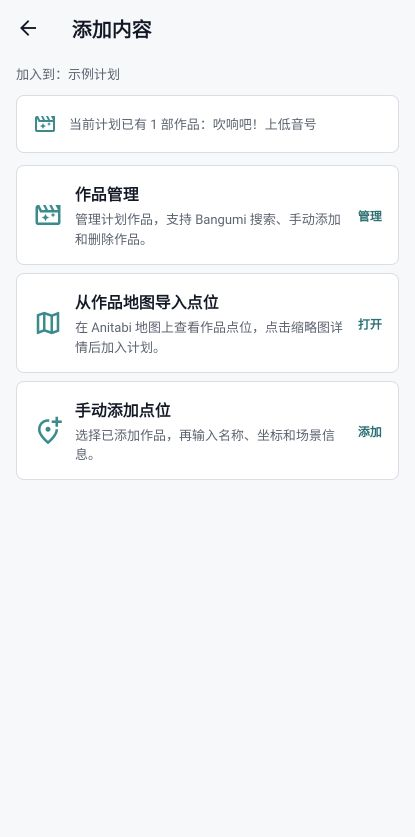
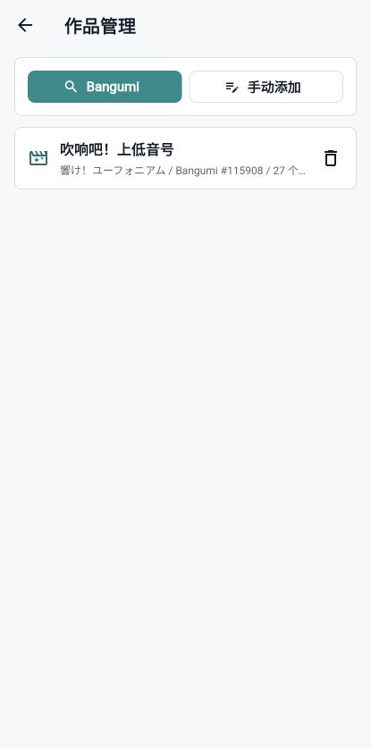
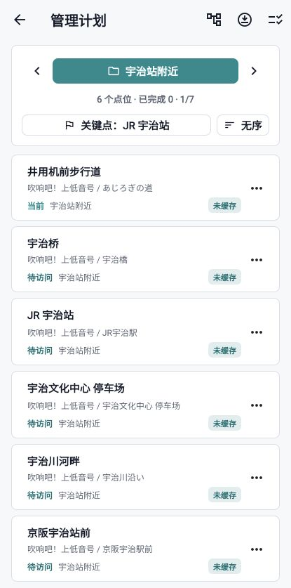
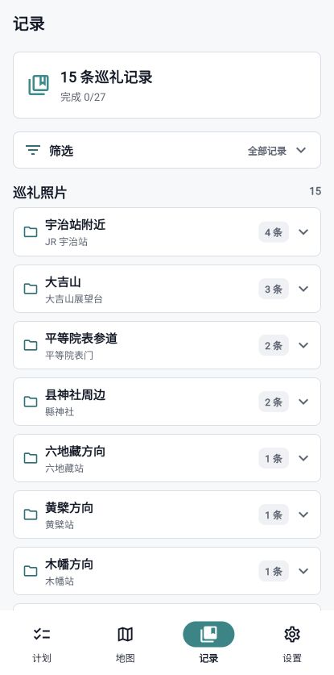
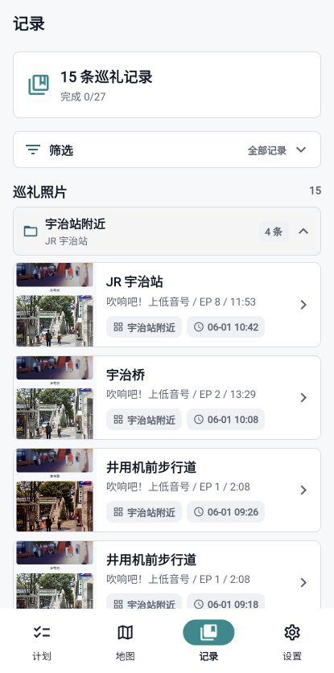
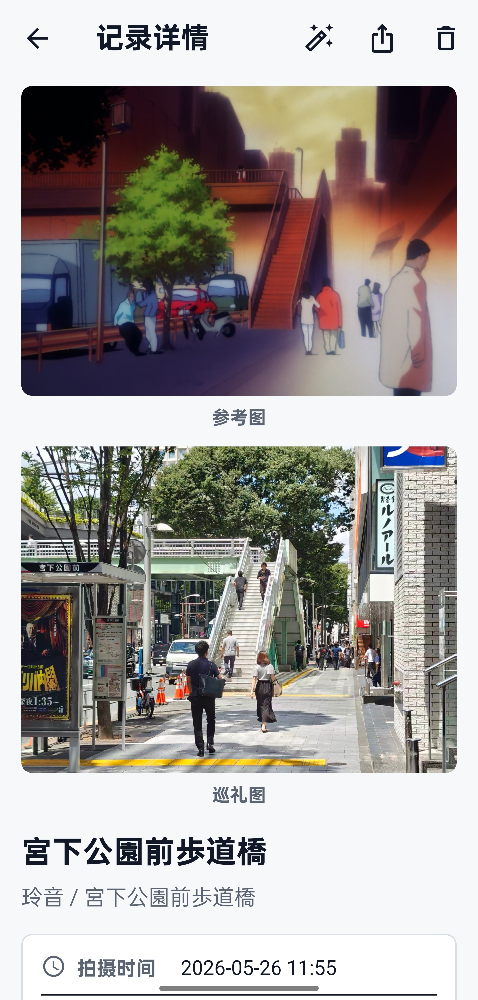
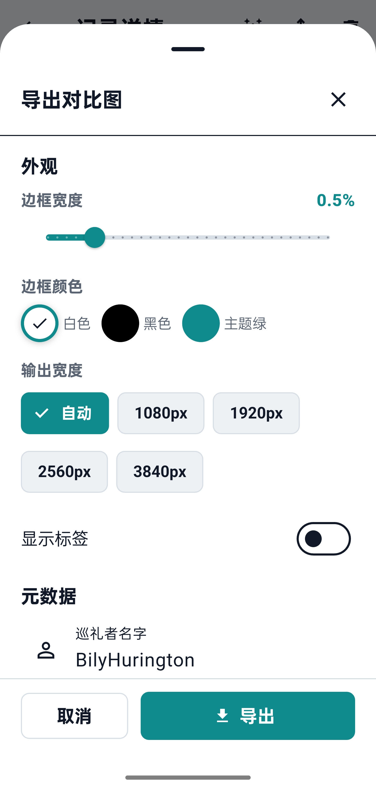

# 使用指南

本文档按一次正常巡礼的准备、执行和整理顺序介绍 MiriaGo。截图中 v1.1 页面来自 Web 预览，拍摄、记录详情和自动调色沿用 v1.0 移动端截图。

## 1. 创建计划

打开应用后进入计划首页。一个计划通常对应一天或一次出行，也可以对应一个城市或一个作品专题。

基本流程：

1. 进入计划管理。
2. 创建新的巡礼计划。
3. 设置计划名称和地区。
4. 回到计划首页确认当前计划已经切换。

计划创建后，可以继续添加作品、点位、片区和巡礼记录。示例计划和普通计划使用同一套数据结构，可以作为完整功能样例使用。

  

## 2. 添加作品

进入“添加内容”页面后，可以为当前计划添加作品。

添加作品有两种方式：

- Bangumi 搜索：输入作品名，从 Bangumi 搜索结果中选择作品。
- 手动添加：适用于 Bangumi 中不存在或暂时不想关联 Bangumi ID 的作品。

如果后续要从 Anitabi 导入点位，建议优先使用 Bangumi 搜索添加作品。Anitabi 点位通过 Bangumi ID 关联作品，使用 Bangumi 搜索可以减少后续匹配成本。

  
  

## 3. 添加点位

点位可以从 Anitabi 导入，也可以手动维护。

从 Anitabi 导入点位：

1. 在“添加内容”页面选择从作品地图导入。
2. 选择一个已经关联 Bangumi ID 的作品。
3. 应用会加载 Anitabi 点位并显示在地图上。
4. 点击地图上的点位，底部会显示点位卡片。
5. 点位卡片包含缩略图、名称、集数时间和来源。
6. 点击缩略图可以查看完整参考图。
7. 点击“加入计划”即可把该点位加入当前计划。

导入点位后，应用会尽量缓存点位信息和缩略图。完整参考图可以之后手动批量缓存，方便离线巡礼时查看。

  

## 4. 添加片区

片区用于把同一计划内的点位拆成更容易执行的小范围，例如“宇治站附近”“大吉山”“平等院表参道”。

建议在点位导入后先建立片区，再整理路线。这样出行时可以按片区推进，而不是在一长串点位中来回查找。

片区管理页面支持：

- 新建、重命名和删除片区。
- 查看每个片区包含的点位数量。
- 查看未分配点位。
- 进入片区点位管理继续整理。

  

## 5. 片区添加关键词和关键点

片区可以设置关键点名称和关键点坐标。关键点通常是车站、桥、商店、寺社、路口或其他容易定位的中心位置。

建议：

- 关键点名称使用现实地图中容易搜索的名称。
- 关键点坐标尽量放在片区中心或集合点附近。
- 关键点可以作为后续自动分配点位的依据。

如果片区名称本身已经包含地名，也可以把片区名和关键点名设置成相近内容，方便巡礼时快速理解。

## 6. 自动分配点位

建立片区和关键点后，可以把未分配点位整理到对应片区。

推荐流程：

1. 先建立所有计划片区。
2. 为每个片区设置关键点。
3. 使用片区管理或点位管理中的分配能力，把点位归入距离或语义最接近的片区。
4. 检查未分配点位，手动修正不确定的点。

自动分配适合先做粗整理，最终路线仍建议人工确认。

## 7. 片区排序

片区排序决定计划首页中片区推进的大顺序。

常见排序方式：

- 按交通路线排序，例如从车站出发再到景区。
- 按时间排序，例如上午片区、下午片区、夜景片区。
- 按作品或章节体验排序，例如先完成同一作品的一组点。

片区排序完成后，计划首页会更接近实际巡礼路线。

## 8. 片区内点位排序

每个片区内部可以选择不同的点位顺序模式：

- 无序模式：适合点位很近、现场自由移动的片区。
- 手动排序：适合需要按街道、坡道、交通方向推进的片区。

如果片区内点位数量较多，建议开启手动排序，把点位调整成从入口到出口的顺序。片区点位管理页面可以按作品筛选、按片区查看、调整顺序、标记完成、删除点位和查看缓存状态。

  

## 9. 出发前离线准备

为了离线查看和现场使用，建议出发前完成：

1. 确认作品和点位已经添加完成。
2. 建立片区和关键点。
3. 按片区整理点位顺序。
4. 批量缓存完整参考图。
5. 打开记录详情确认参考图可以离线显示。
6. 导出一份 `.sjhplan` 数据包作为备份。

地图瓦片来自网络，离线时地图底图可能无法加载，但已缓存的参考图和本地记录仍可使用。

## 10. 巡礼时：地图、导航与拍摄参考

地图页面会显示当前计划中的点位。应用本身负责显示地图、坐标和点位信息；实际导航会跳转到外部地图应用，例如 Google 地图或系统地图。

  

在点位详情或当前目标点位中，可以进入拍摄参考页面。

当前支持：

- 叠影参考：把参考图以透明叠层显示在取景画面上。
- 上下参考：上方参考图，下方取景画面。
- 从相册导入巡礼图。
- 拍摄后进入确认页面。

确认后，应用会保存巡礼记录，并把参考图和拍摄图关联起来。

   
  

## 11. 巡礼时：保存和查看记录

记录页面用于查看已经保存的巡礼照片。

支持：

- 按作品查看记录。
- 展开筛选菜单。
- 搜索点位信息。
- 查看记录详情。
- 删除记录。
- 进入自动调色。
- 导出对比图。

如果点位参考图已经缓存，即使断网，记录详情也会优先显示本地缓存图。

  
  

记录详情会同时显示参考图和巡礼图。点击图片可以进入大图查看；在 Web / 桌面端大图页长按后只保留“保存图片”，桌面端会弹出保存位置选择窗口，普通 Web 会走浏览器下载。

  

## 12. 巡礼后：自动调色

自动调色用于让巡礼图的色调尽量接近参考图。

基本流程：

1. 打开记录详情。
2. 点击自动调色按钮。
3. 选择匹配模式。
4. 点击自动匹配色调。
5. 使用强度滑块调整应用比例。
6. 长按“显示原图”按钮可以快速对比调色前后。
7. 点击保存后，记录详情会默认显示调色后的巡礼图，同时保留原图和调色参数。

自动调色不是生成式 AI，不需要训练模型。它使用可解释的常见调色参数，例如曝光、对比度、饱和度、高光、阴影和 RGB 曲线。

  

## 13. 巡礼后：导出对比图

记录详情中可以导出对比图。

导出页面支持：

- 设置主题。
- 设置边框。
- 设置输出宽度。
- 选择显示哪些元数据。
- 添加巡礼者名字。
- 选择是否显示调色参数。

导出配置会自动保存，下次导出时会使用上一次的设置。

  
  

## 14. 导入导出计划

计划首页的菜单中可以进入“导入导出”页面。

MiriaGo 支持两类导出：

- MiriaGo 数据包：`.sjhplan` v2 数据包，内部为 zip，包含 `manifest.json`。
- Google My Maps CSV：用于把点位导入 Google My Maps，图片以链接形式写入。

导出 MiriaGo 数据包时可以选择：

- 纯计划：只包含作品、片区、点位、完成状态和当前目标。
- 计划 + 记录：同时包含巡礼记录和记录照片路径。
- 包含完整参考图缓存：默认至少包含缩略图和用户手动添加参考图；打开该选项后会尽量把完整参考图也放入包内。

导入时会先进入预览页面，用户可以选择导入计划结构、巡礼记录、图片和资源文件。移动端和桌面端会尽量恢复包内本地资源；普通 Web 预览环境可能只能预览数据结构，不能完整恢复本地资源。

桌面端导出数据包和 CSV 时会弹出保存位置选择窗口。macOS / Windows zip 版本会把应用数据、数据库和资源保存在 `MiriaGoData` 文件夹内，便于整体备份或迁移。

  

## 15. 导入 Google My Maps

如果希望在 Google My Maps 中制作独立地图，可以从 MiriaGo 导出 CSV 后导入。

推荐流程：

1. 在 MiriaGo 的“导入导出”页面导出 Google My Maps CSV。
2. 打开 Google My Maps，新建地图或打开已有地图。
3. 在目标图层中选择导入 CSV。
4. 上传 MiriaGo 导出的 CSV 文件。
5. 选择需要作为位置的数据列，通常使用经纬度相关列。
6. 选择 `Name` 列作为地点名称。
7. 导入完成后，打开图层样式设置。
8. 将图层样式按 `Type` 分组，这样可以区分点位、关键点或其他类型。

CSV 中的图片会以链接形式写入。Google My Maps 是否显示图片预览，取决于链接可访问性和 My Maps 当前的导入规则。

## 16. 桌面端数据和保存位置

macOS / Windows zip 版本以独立应用形式分发。应用旁边会有 `MiriaGoData` 文件夹，用于保存数据库、资源文件和本地缓存。

建议：

- 不要只移动应用本体，迁移时一起移动 `MiriaGoData`。
- 导出 `.sjhplan` 数据包作为长期备份。
- 导出 CSV 或数据包时优先选择自己容易找到的保存位置。

## 17. 离线功能限制

离线时可用内容：

- 已缓存的缩略图和完整参考图。
- 已保存的巡礼记录。
- 本地计划结构、片区和完成状态。
- 已导出的数据包。

离线时可能不可用内容：

- 地图底图。
- Anitabi 新点位加载。
- Bangumi 搜索。
- 未缓存的远程图片。

因此，正式出发前最好完成点位导入、片区整理、参考图缓存和数据包备份。
